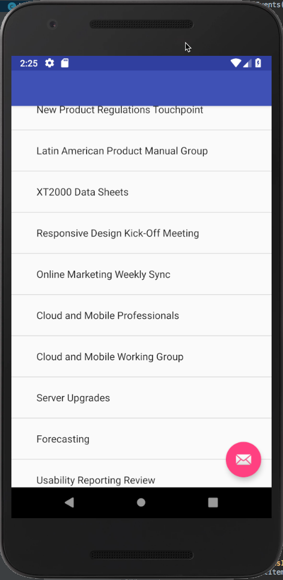

# Integrate Microsoft Graph into the Application

The last step is to incorporate the Microsoft Graph into the application. For this application, you will use the Microsoft Graph Java SDK.

> This demo builds off the final product from the previous demo.

1. Add the required Microsoft Graph Java SDK dependencies to the project using Gradle:
    1. Open the **Gradle Scripts > build.gradle (Module: app)** file.
    1. Add the following code to the `dependencies` section, immediately after the previously added dependencies:

        ```gradle
        implementation 'com.microsoft.graph:microsoft-graph:1.0.+'
        ```

    1. Add the following code to the project **app > build.gradle (Module: app)** file at the end of the existing `android` section

        ```gradle
        packagingOptions {
          pickFirst 'META-INF/jersey-module-version'
        }
        ```

    1. Sync the dependencies with the project by selecting **File > Sync Project with Gradle Files**.

1. Add a utility class to the project that acts as a singleton to create an instance of the Microsoft Graph client:
    1. In the **Android** tool window, right-click the **app > java > com.microsoft.nativeo365calendarevents** and select **New > Java Class**:
    1. Name the class **MSGraphServiceClientManager** and select **OK**.
    1. Add the following `import` statements to the existing `import` statements:

        ```java
        import android.content.Context;
        import android.util.Log;

        import com.microsoft.graph.authentication.IAuthenticationProvider;
        import com.microsoft.graph.core.DefaultClientConfig;
        import com.microsoft.graph.core.IClientConfig;
        import com.microsoft.graph.requests.extensions.GraphServiceClient;
        import com.microsoft.graph.models.extensions.IGraphServiceClient;
        import com.microsoft.graph.http.IHttpRequest;
        ```

    1. Update the `MSGraphServiceClientManager` class to implement the `IAuthenticationProvider` interface:

        ```java
        public class MSGraphServiceClientManager implements IAuthenticationProvider
        ```

    1. Add the following members to implement the `MSGraphServiceClientManager` class. This is used to create a new instance of the **MicrosoftServiceClient** object using the access token required from Azure AD:

        ```java
        private final static String TAG = MSGraphServiceClientManager.class.getSimpleName();
        private IGraphServiceClient graphClient;
        private static MSGraphServiceClientManager INSTANCE;
        private static Context context;

        @Override
        public void authenticateRequest(IHttpRequest request) {
          try {
            request.addHeader("Authorization", "Bearer "
                    + AuthenticationController.getInstance(context)
                    .getAccessToken());
          } catch (NullPointerException e) {
            e.printStackTrace();
          }
        }

        public static synchronized MSGraphServiceClientManager getInstance(Context ctx) {
          context = ctx;
          if (INSTANCE == null) {
            INSTANCE = new MSGraphServiceClientManager();
          }
          return INSTANCE;
        }

        public synchronized IGraphServiceClient getGraphServiceClient() {
          return getGraphServiceClient(this);
        }

        public synchronized IGraphServiceClient getGraphServiceClient(IAuthenticationProvider authenticationProvider) {
          if (graphClient == null){
            graphClient = GraphServiceClient.builder().authenticationProvider(authenticationProvider).buildClient();
          }
          return graphClient;
        }
        ```

1. Add a class to the project that acts as the Microsoft Graph controller for the application:
    1. In the **Android** tool window, right-click the **app > java > com.microsoft.nativeo365calendarevents** and select **New > Java Class**:
    1. Name the class **MSGraphServiceController** and select **OK**.
    1. Add the following `import` statements to the existing `import` statements:

        ```java
        import android.content.Context;
        import android.util.Log;
        import com.google.common.util.concurrent.SettableFuture;

        import com.microsoft.graph.concurrency.ICallback;
        import com.microsoft.graph.core.ClientException;
        import com.microsoft.graph.models.extensions.Event;
        import com.microsoft.graph.requests.extensions.IEventCollectionPage;
        import com.microsoft.graph.requests.extensions.IEventCollectionRequest;
        import com.microsoft.graph.models.extensions.IGraphServiceClient;
        import com.microsoft.graph.options.Option;
        import com.microsoft.graph.options.QueryOption;

        import java.util.ArrayList;
        import java.util.Arrays;
        import java.util.List;
        ```

    1. Add the following members to implement the `MSGraphServiceController` class:

        ```java
        private final static String TAG = MSGraphServiceController.class.getSimpleName();
        private final IGraphServiceClient graphClient;
        final List<String> events = new ArrayList<>();

        public MSGraphServiceController(Context context) {
          graphClient = MSGraphServiceClientManager.getInstance(context).getGraphServiceClient();
        }

        public SettableFuture<List<String>> getEvents() {
          final SettableFuture<List<String>> result = SettableFuture.create();

          IEventCollectionRequest request = graphClient
                  .me()
                  .events()
                  .buildRequest(
                          Arrays.asList(
                                  new QueryOption("$select", "subject,start,end"),
                                  new QueryOption("$top", "20"),
                                  new QueryOption("$skip", "0"))
                  );

          request.get(new ICallback<IEventCollectionPage>() {
            @Override
            public void success(IEventCollectionPage page) {
              List<Event> listOfEvents = page.getCurrentPage();
              for (Event item : listOfEvents) {
                events.add(item.subject);
              }
              result.set(events);
            }

            @Override
            public void failure(ClientException ex) {
              ex.printStackTrace();
            }
          });

          return result;
        }
        ```

1. The last step is to update the user interface to trigger the call to the Microsoft Graph to get a list of events from your calendar.
    1. In the **Android** tool window, locate and open the file **app > java > com.microsoft.nativeo365calendarevents > MainActivity**.
    1. Add the following `import` statements to the existing `import` statements:

        ```java
        import android.widget.ArrayAdapter;
        import com.google.common.util.concurrent.FutureCallback;
        import com.google.common.util.concurrent.Futures;
        import com.google.common.util.concurrent.SettableFuture;
        import java.util.List;
        ```

    1. Add the following method to handle binding an array of items to the list control:

        ```java
        private void bindEvents(List<String> events) {
          setPanelVisibility(false, false, true);

          ArrayAdapter<String> adapter = new ArrayAdapter<String>(
            this,
            android.R.layout.simple_expandable_list_item_1,
            events);
          listEvents.setAdapter(adapter);
        }
        ```

    1. Locate and replace the existing `onLoadEvents()` method with the following implementation that will use the Microsoft Graph controller previously created to get a list of events from your calendar. It will then bind them to the list control using the previously added method.

        ```java
        private void onLoadEvents() {
          MSGraphServiceController graphController = new MSGraphServiceController(this);

          progress = ProgressDialog.show(this, "Loading", "Loading first 20 events...");
          SettableFuture<List<String>> events = graphController.getEvents();
          Futures.addCallback(events, new FutureCallback<List<String>>() {
            @Override
            public void onSuccess(final List<String> result) {
              runOnUiThread(new Runnable() {
                @Override
                public void run() {
                  Toast.makeText(MainActivity.this, "Loaded events success!", Toast.LENGTH_LONG).show();
                  progress.dismiss();
                  bindEvents(result);
                }
              });
            }

            @Override
            public void onFailure(Throwable t) {

            }
          });
        }
        ```

1. Test the Microsoft Graph integration:
    1. Select **Run > Run 'app'**.
    1. In the **Select Deployment Target** dialog, select a device to target and then select **OK**.
    1. When the application loads in the simulator, select the **Signin** button.
    1. After completing the authentication and consent process, you will be taken back to the Android application where a toast message will appear with your Azure AD details in it.

        Select the **Load Events** button to trigger the call to the Microsoft Graph.
    1. After a moment you will see the UI update the a list of some events from your Office 365 calendar:

        