# Build Android native apps with the Microsoft Graph Android SDK

In this lab you will create a new Android native application with Android Studio that will display events in your Office 365 calendar using an Azure AD application with the Microsoft Graph Android SDK & Microsoft Authentication Library (MSAL).

## In this lab

* [Create an Azure AD native application with the App Registration Portal](#exercise1)
* [Create an Android native application](#exercise2)
* [Extend the Android App for Azure AD Authentication](#exercise3)
* [Integrate Microsoft Graph into the Application](#exercise4)

## Prerequisites

To complete this lab, you need the following:

* Office 365 tenancy
  * If you do not have one, you obtain one (for free) by signing up to the [Office 365 Developer Program](https://developer.microsoft.com/en-us/office/dev-program).
* [Android Studio](https://developer.android.com/studio/) v3.1.2
* [Android SDK](https://developer.android.com/studio/releases/sdk-tools) v26+

<a name="exercise1"></a>

## Exercise 1: Create an Azure AD native application with the App Registration Portal

In this exercise you will create a new Azure AD native application using the App Registry Portal (ARP).

1. Open a browser and navigate to the **App Registry Portal**: **apps.dev.microsoft.com** and login using a **personal account** (aka: Microsoft Account) or **Work or School Account**.
1. Select **Add an app** at the top of the page.
1. On the **Register your application** page, set the **Application Name** to **NativeO365CalendarEvents** and select **Create**.

    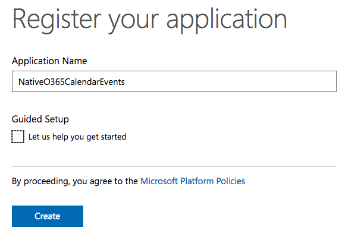

1. On the **NativeO365CalendarEvents Registration** page, under the **Properties** section, copy the **Application Id** Guid as you will need it later.

    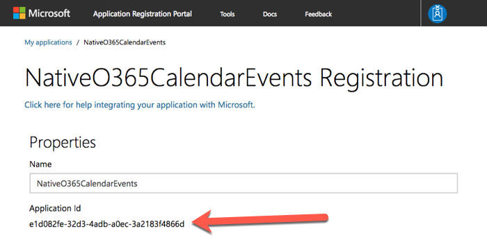

1. Scroll down to the **Platforms** section.

    1. Select **Add Platform**.
    1. In the **Add Platform** dialog, select **Native Application**.

        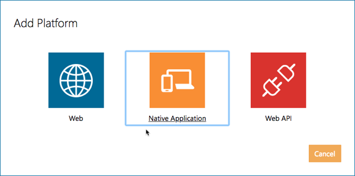

    1. After the native application platform is created, copy the **Custom Redirect URIs** as you will need it later.

        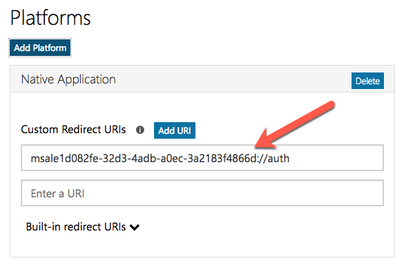

        > Unlike application secrets that are only displayed a single time when they are created, the custom redirect URIs are always shown so you can come back and get this string if you need it later.

1. In the **Microsoft Graph Permissions** section, select **Add** next to the **Delegated Permissions** subsection.

    

    In the **Select Permission** dialog, locate and select the permission **Calendars.Read** and select **OK**:

      

      

1. Scroll to the bottom of the page and select **Save**.

<a name="exercise2"></a>

## Exercise 2: Create an Android native application

In this exercise you will create an Android application and wire up the different screens.

1. Open **Android Studio**
1. Select **Start a new Android Studio project**.
1. In the new project dialog, set the following values:
    * **Application name:** NativeO365CalendarEvents
    * **Company domain:** microsoft.com

    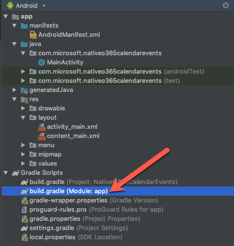

1. In the **Target Android Devices** dialog, set the following values and select **Next**:
    * **Phone and Tablet**: selected and pick the desired Android version you want to target... select an API version 23 or higher
    * leave all other options selected

    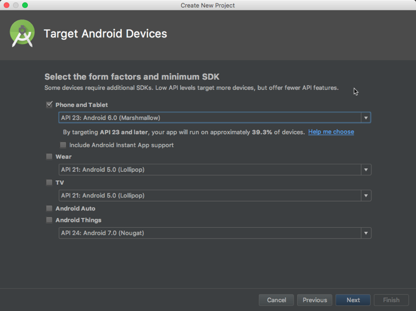

1. In the **Add an Activity to Mobile** dialog, select **Basic Activity** and select **Next**:

    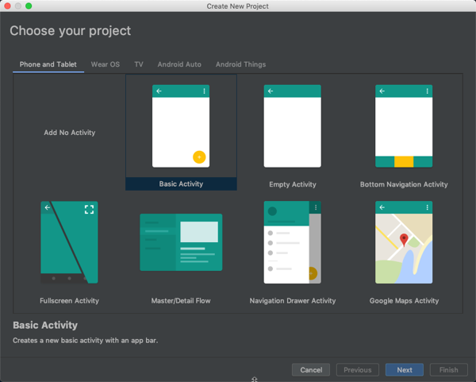

1. In the **Configure Activity** dialog, leave the default values and select **Finish**:

    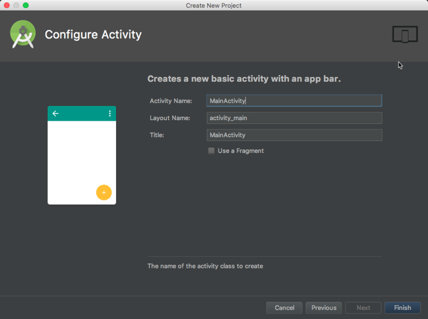

1. Add the necessary dependencies to the project:
    1. In the **Android** tool window, locate and open the file **Gradle Scripts > build.gradle (Module: app)**:

        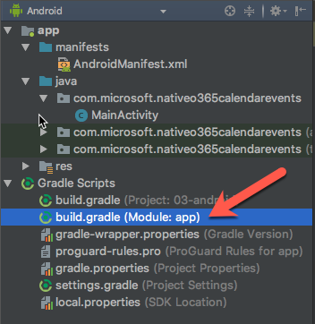

    1. Add the following implementations to the top of the existing `dependencies` section:

        ```gradle
        implementation 'com.google.code.gson:gson:2.3.1'
        implementation 'com.google.guava:guava:25.1-android'
        ```

    1. Sync the dependencies with the project by selecting **File > Sync Project with Gradle Files**.

### Create the Application User Interface

The first step is to create the shell of the user experience; creating a workable storyboard.

1. In the **Android** tool window, locate and open the file **app > res > layout > content_main.xml**.
1. At the bottom of the **content_main.xml** file, select the **Text** tab to switch to the code view of the layout:

    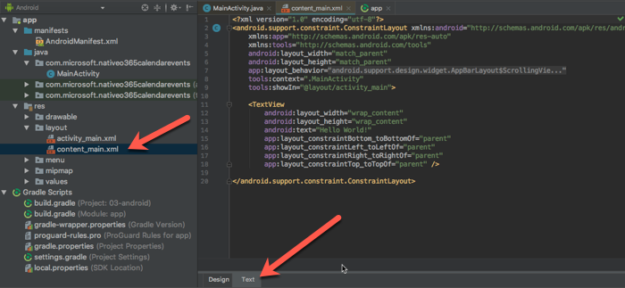

1. Replace the entire contents of the **content_main.xml** file with the following markup:

    ```xml
    <?xml version="1.0" encoding="utf-8"?>
    <LinearLayout xmlns:android="http://schemas.android.com/apk/res/android"
        android:orientation="vertical"
        android:layout_width="match_parent"
        android:layout_height="match_parent">

        <LinearLayout
            android:layout_width="match_parent"
            android:layout_height="wrap_content"
            android:id="@+id/panel_signIn"
            android:paddingTop="60dp"
            android:visibility="visible"
            android:orientation="vertical">
            <Button
                android:layout_width="wrap_content"
                android:layout_height="wrap_content"
                android:text="Sign In"
                android:id="@+id/btn_signIn"
                android:layout_gravity="center"
                android:paddingTop="5dp"
                android:paddingBottom="5dp"
                android:paddingLeft="35dp"
                android:paddingRight="35dp"
                />
        </LinearLayout>
        <LinearLayout
            android:layout_width="match_parent"
            android:layout_height="wrap_content"
            android:id="@+id/panel_loadEvent"
            android:paddingTop="60dp"
            android:visibility="gone"
            android:orientation="vertical">
            <Button
                android:layout_width="wrap_content"
                android:layout_height="wrap_content"
                android:text="Load Events"
                android:id="@+id/btn_loadEvent"
                android:layout_gravity="center"
                android:paddingTop="5dp"
                android:paddingBottom="5dp"
                android:paddingLeft="35dp"
                android:paddingRight="35dp"
              />
            <Button
                android:layout_width="wrap_content"
                android:layout_height="wrap_content"
                android:text="Sign out"
                android:id="@+id/btn_signOut"
                android:layout_gravity="center"
                android:paddingTop="5dp"
                android:paddingBottom="5dp"
                android:paddingLeft="35dp"
                android:paddingRight="35dp"
              />
        </LinearLayout>
        <LinearLayout
            android:layout_width="match_parent"
            android:layout_height="wrap_content"
            android:id="@+id/panel_events"
            android:visibility="gone"
            android:orientation="vertical">
            <TextView
                android:layout_width="wrap_content"
                android:layout_height="wrap_content"
                android:paddingTop="5dp"
                android:paddingBottom="5dp"
                android:paddingLeft="5dp"
                android:textSize="14sp"
                android:text="Events"/>
            <ListView
                android:layout_width="wrap_content"
                android:layout_height="wrap_content"
                android:id="@+id/list_events"
                android:padding="0dp"
                android:paddingLeft="0dp"
                android:paddingTop="0dp"
                android:paddingRight="0dp"
                android:paddingBottom="0dp" />
        </LinearLayout>
    </LinearLayout>
    ```

1. In the **Android** tool window, locate and open the file **app > java > com.microsoft.nativeo365calendarevents >MainActivity**.
    1. Add the following `import` statements to the existing `import` statements:

        ```java
        import android.widget.LinearLayout;
        import android.widget.ListView;
        import android.widget.Toast;
        import android.app.ProgressDialog;
        ```

    1. Add the following members to the `MainActivity` class:

        ```java
        private final static String TAG = MainActivity.class.getSimpleName();

        private ProgressDialog progress;
        private ListView listEvents;
        private LinearLayout panelSignIn;
        private LinearLayout panelEvents;
        private LinearLayout panelLoadEvent;
        ```

    1. Add the following methods to the `MainActivity` class:

        ```java
        private void onSignin() {
          Toast.makeText(MainActivity.this, "Hello <user>!", Toast.LENGTH_LONG).show();

          setPanelVisibility(false,true,false);
        }

        private void onSignout() {
          setPanelVisibility(true, false, false);
        }

        private void onLoadEvents() {
          Toast.makeText(MainActivity.this, 
            "Successfully loaded events from Office 365 calendar", 
            Toast.LENGTH_LONG
          ).show();
        }

        private void setPanelVisibility(Boolean showSignIn, Boolean showLoadEvents, Boolean showList) {
          panelSignIn.setVisibility(showSignIn ? View.VISIBLE : View.GONE);
          panelLoadEvent.setVisibility(showLoadEvents ? View.VISIBLE : View.GONE);
          panelEvents.setVisibility(showList ? View.VISIBLE : View.GONE);
        }
        ```

    1. Replace the existing code in the `onCreate()` method with the following code:

        ```java
        super.onCreate(savedInstanceState);
        setContentView(R.layout.activity_main);

        listEvents = findViewById(R.id.list_events);
        panelSignIn = findViewById(R.id.panel_signIn);
        panelEvents = findViewById(R.id.panel_events);
        panelLoadEvent = findViewById(R.id.panel_loadEvent);

        (findViewById(R.id.btn_signIn)).setOnClickListener(new View.OnClickListener() {
          @Override
          public void onClick(View view) {
            onSignin();
          }
        });

        (findViewById(R.id.btn_signOut)).setOnClickListener(new View.OnClickListener() {
          @Override
          public void onClick(View view) {
            onSignout();
          }
        });

        (findViewById(R.id.btn_loadEvent)).setOnClickListener(new View.OnClickListener() {
          @Override
          public void onClick(View view) {
            onLoadEvents();
          }
        });

        setPanelVisibility(true, false, false);
        ```

1. Test the user interface changes to ensure the flow off the application is working.

    Select **Run > Run 'app'**.

    In the **Select Deployment Target** dialog, select a device to target and then select **OK**:

    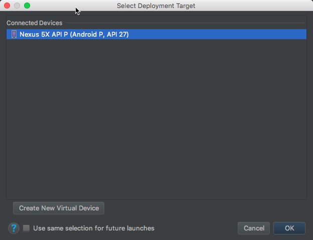.

    > If there are no **Connected Devices** available, select the **Create New Virtual Device** and select an option, such as the **Nexus 5X** as shown in the previous screenshot.

    1. After a moment the simulator will start and Android Studio will deploy and start the application.

        > If you get an error, it is likely an issue where the simulator didn't boot up fast enough for Android Studio. Simply stop the application in Android Studio (**Run > Stop 'app'**) but leave the simulator running. Then start the application again.

          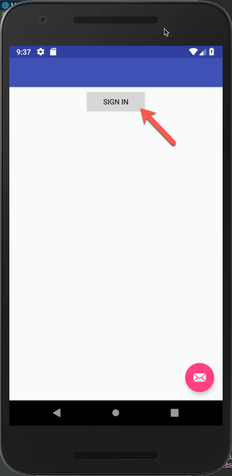

        When the application loads, select the **Sign In** button. Notice the toast message displayed at the bottom of the screen:

          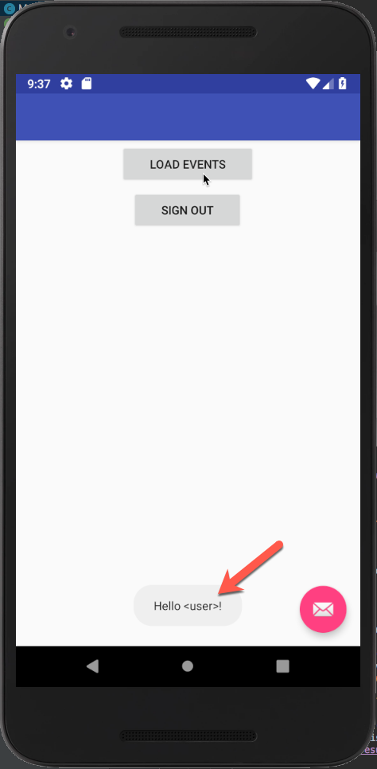

        Next, select the **Load Events** button. Notice the toast message displayed at the bottom of the screen:

          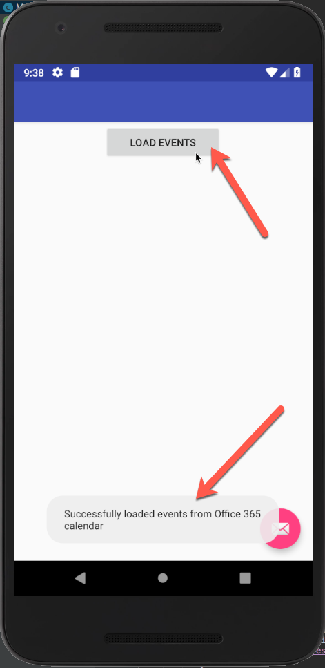

<a name="exercise3"></a>

## Exercise 3: Extend the Android App for Azure AD Authentication

With the application created, now extend it to support authentication with Azure AD. This is required to obtain the necessary OAuth access token to call the Microsoft Graph. In this step you will integrate the Microsoft Authentication Library (MSAL) into the application.

1. Add the required MSAL dependencies to the project using Gradle:

    1. Open the **Gradle Scripts > build.gradle (Module: app)** file.
    1. Add the following code to the top of the `dependencies` section, immediately before the dependencies added in the previous section:

        ```gradle
        implementation('com.microsoft.identity.client:msal:0.1.3') {
            exclude group: 'com.android.support', module: 'appcompat-v7'
            exclude group: 'com.google.code.gson'
        }
        implementation 'com.android.volley:volley:1.0.0'
        ```

    1. Sync the dependencies with the project by selecting **File > Sync Project with Gradle Files**.

1. Configure the application with necessary permissions and configurations for MSAL.

    1. Open the **app > manifests > AndroidManifest.xml** file.
    1. Grant the application permissions to access the internet and network state from the Android platform by adding the following two lines immediately after the opening `<manifest>` element:

        ```xml
        <uses-permission android:name="android.permission.INTERNET" />
        <uses-permission android:name="android.permission.ACCESS_NETWORK_STATE" />
        ```

    1. Add an activity for the application in the **AndroidManifest.xml** file to allow the MSAL library to use the browser for prompting the user to authenticate with Azure AD. Add the following after the existing `<activity>` element:

        ```xml
        <activity
            android:name="com.microsoft.identity.client.BrowserTabActivity">
            <intent-filter>
                <action android:name="android.intent.action.VIEW" />
                <category android:name="android.intent.category.DEFAULT" />
                <category android:name="android.intent.category.BROWSABLE" />
                <data android:scheme="msal{{REPLACE_WITH_APP_ID}}"
                      android:host="auth" />
            </intent-filter>
        </activity>
        ```

    1. Replace the `{{REPLACE_WITH_APP_ID}}` in the markup above with the value of the Azure AD application copied when creating a the Azure AD application in [exercise 1 above](#exercise1). Do not remove the **msal** prefix in the markup above.

      > The MSAL Android SDK does not require you to enter the redirect URI provided by the App Registration Portal. It can use the information provided in this step to dynamically generate the redirect URI for you.

1. Add an class to declare a new callback type that you will use:
    1. In the **Android** tool window, right-click the **app > java > com.microsoft.nativeo365calendarevents** and select **New > Java Class**:

        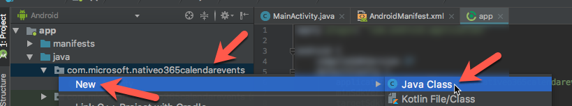

    1. Name the class **Constants** and select **OK**.

        ```java
        public static final String[] SCOPES = {"openid", "User.Read", "Calendars.Read"};
        public static final String CLIENT_ID = "{{REPLACE_WITH_APP_ID}}";
        ```

    1. Replace the `{{REPLACE_WITH_APP_ID}}` in the markup above with the value of the Azure AD application copied when creating a the Azure AD application in [exercise 1 above](#exercise1). Do not remove the **msal** prefix in the markup above.

1. Add an interface to declare a new callback type that you will use:
    1. In the **Android** tool window, right-click the **app > java > com.microsoft.nativeo365calendarevents** and select **New > Java Class**:
    1. Name the class **MSALAuthenticationCallback**, set the **Kind** to **Interface** and select **OK**.
    1. Add the following `import` statements to the existing `import` statements:

        ```java
        import android.app.Activity;
        import android.content.Context;
        import android.util.Log;
        import com.microsoft.identity.client.AuthenticationCallback;
        import com.microsoft.identity.client.AuthenticationResult;
        import com.microsoft.identity.client.MsalException;
        import com.microsoft.identity.client.PublicClientApplication;
        ```

    1. Add the following code to the `MSALAuthenticationCallback` interface:

        ```java
        void onMsalAuthSuccess(AuthenticationResult authenticationResult);
        void onMsalAuthError(MsalException exception);
        void onMsalAuthError(Exception exception);
        void onMsalAuthCancel();
        ```

1. Add an authentication helper class:
    1. In the **Android** tool window, right-click the **app > java > com.microsoft.nativeo365calendarevents** and select **New > Java Class**:
    1. Name the class **AuthenticationController** and select **OK**.
    1. Add the following `import` statements to the existing `import` statements:

        ```java
        import android.app.Activity;
        import android.content.Context;
        import android.util.Log;

        import com.microsoft.identity.client.AuthenticationCallback;
        import com.microsoft.identity.client.AuthenticationResult;
        import com.microsoft.identity.client.MsalException;
        import com.microsoft.identity.client.PublicClientApplication;
        ```

    1. Add the following members to the `AuthenticationController` class that will be used throughout this class:

        ```java
        private final String TAG = AuthenticationController.class.getSimpleName();
        private static AuthenticationController INSTANCE;
        private static PublicClientApplication mApplication;
        private AuthenticationResult mAuthResult;
        private static Context context;

        private MSALAuthenticationCallback mActivityCallback;
        ```

    1. Add the following code to the `AuthenticationController` class to implement a builder pattern:

        ```java
        private AuthenticationController() {
        }

        public static synchronized AuthenticationController getInstance(Context ctx) {
          context = ctx;

          if (INSTANCE == null) {
            INSTANCE = new AuthenticationController();
            if (mApplication == null) {
              mApplication = new PublicClientApplication(context, Constants.CLIENT_ID);
            }
          }
          return INSTANCE;
        }

        public static synchronized void resetInstance() {
          INSTANCE = null;
        }
        ```

    1. Add the following code to the `AuthenticationController` class to provide options for getting in instance of the Azure AD public client and access token:

        ```java
        public String getAccessToken() {
          return mAuthResult.getAccessToken();
        }

        public PublicClientApplication getPublicClient() {
          return mApplication;
        }
        ```

    1. Add the following code to the `AuthenticationController` class. One method (`doAcquireToken()`) will trigger the interactive authentication process with Azure AD. It passes an `AuthenticationCallback` that defines what happens after a successful, failed or cancelled authentication.

        ```java
        public void doAcquireToken(Activity activity, final MSALAuthenticationCallback msalCallback) {
          mActivityCallback = msalCallback;
          mApplication.acquireToken(activity, Constants.SCOPES, getAuthInteractiveCallback());
        }

        private AuthenticationCallback getAuthInteractiveCallback() {
          return new AuthenticationCallback() {
            @Override
            public void onSuccess(AuthenticationResult authenticationResult) {
              mAuthResult = authenticationResult;
              if (mActivityCallback != null) {
                mActivityCallback.onMsalAuthSuccess(mAuthResult);
              }
            }

            @Override
            public void onError(MsalException exception) {
              if (mActivityCallback != null) {
                mActivityCallback.onMsalAuthError(exception);
              }
            }

            @Override
            public void onCancel() {
              if (mActivityCallback != null) {
                mActivityCallback.onMsalAuthCancel();
              }
            }
          };
        }
        ```

    1. Add the following code to the `AuthenticationController` class to sign out of the application:

        ```java
        public void signout() {
          mApplication.remove(mAuthResult.getUser());
          // Reset the AuthenticationManager object
          AuthenticationController.resetInstance();
        }
        ```

1. The callback added in the last step calls the provided callback based on the results of the authentication prompt. While there are many ways to implement the callback, this application will implement it on the **MainActivity**.
    1. In the **Android** tool window, locate and open the file **app > java > com.microsoft.nativeo365calendarevents > MainActivity**.
    1. Update the `MainActivity` class to implement the `MSALAuthenticationCallback`:

        ```java
        public class MainActivity extends AppCompatActivity implements MSALAuthenticationCallback
        ```

    1. Add the following `import` statements to the existing `import` statements:

        ```java
        import android.content.Intent;
        import android.util.Log;

        import com.microsoft.identity.client.AuthenticationResult;
        import com.microsoft.identity.client.MsalException;
        import com.microsoft.identity.client.User;
        ```

    1. Add the following methods to implement the `MSALAuthenticationCallback` interface.

        ```java
        //region MSALAuthenticationCallback() implementation
        // these methods are called by the AuthenticationController
        @Override
        public void onMsalAuthSuccess(AuthenticationResult authenticationResult) {
          User user = authenticationResult.getUser();

          Toast.makeText(MainActivity.this, "Hello " + user.getName() 
            + " (" + user.getDisplayableId() + ")!", Toast.LENGTH_LONG
            ).show();

          setPanelVisibility(false, true, false);
        }

        @Override
        public void onMsalAuthError(MsalException exception) {
          Log.e(TAG, "Error authenticated", exception);
        }

        @Override
        public void onMsalAuthError(Exception exception) {
          Log.e(TAG, "Error authenticated", exception);
        }

        @Override
        public void onMsalAuthCancel() {
          Log.d(TAG, "Cancel authenticated");
        }
        //endregion
        ```

1. Wire up the signin and signout buttons to the authentication process:
    1. Replace the contents of the `onSignin()` method to the following code:

    ```java
    private void onSignin() {
      AuthenticationController authController = AuthenticationController.getInstance(this);
      authController.doAcquireToken(this, this);
    }

    private void onSignout() {
      AuthenticationController authController = AuthenticationController.getInstance(this);
      authController.signout();

      setPanelVisibility(true, false, false);
    }
    ```

1. Add the following method to the `MainActivity` class for the UI to update when there's an update to the activity, as in this case when the Android application receives control back from the browser that handled the authentication process:

    ```java
    @Override
    protected void onActivityResult(int requestCode, int resultCode, Intent data) {
      super.onActivityResult(requestCode, resultCode, data);
      if (AuthenticationController.getInstance(this).getPublicClient() != null) {
        AuthenticationController.getInstance(this).getPublicClient().handleInteractiveRequestRedirect(requestCode, resultCode, data);
      }
    }
    ```

1. Test the user interface changes to ensure the flow off the application is working.
    1. Select **Run > Run 'app'**.
    1. In the **Select Deployment Target** dialog, select a device to target and then select **OK**.
    1. When the application loads in the simulator, select the **Signin** button.
    1. The application will load the Azure AD authentication page. Login with your Office 365 Azure AD credentials.

        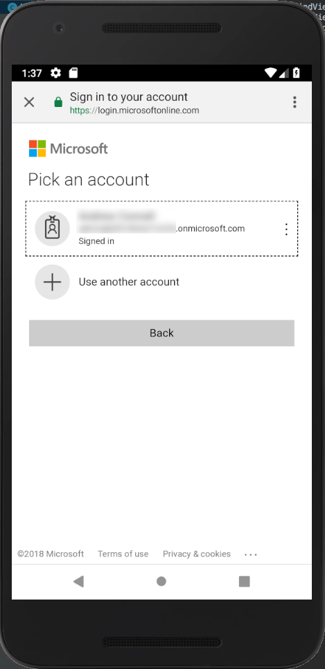

        After successfully logging in, you may be prompted to consent to the permissions requested by the application. If prompted, agree to the consent dialog.

    1. After completing the authentication and consent process, you will be taken back to the Android application where a toast message will appear with your Azure AD details in it.

        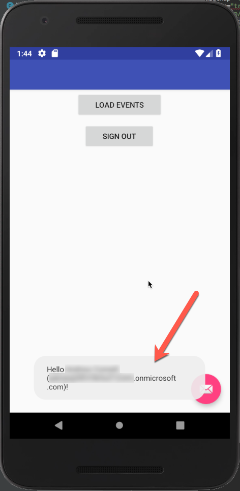

<a name="exercise4"></a>

## Exercise 4: Integrate Microsoft Graph into the Application

The last step is to incorporate the Microsoft Graph into the application. For this application, you will use the Microsoft Graph Android SDK.

1. Add the required Microsoft Graph Android SDK dependencies to the project using Gradle:
    1. Open the **Gradle Scripts > build.gradle (Module: app)** file.
    1. Add the following code to the `dependencies` section, immediately after the previously added dependencies:

        ```gradle
        implementation 'com.microsoft.graph:msgraph-sdk-android:1.3.2'
        ```

    1. Sync the dependencies with the project by selecting **File > Sync Project with Gradle Files**.

1. Add a utility class to the project that acts as a singleton to create an instance of the Microsoft Graph client:
    1. In the **Android** tool window, right-click the **app > java > com.microsoft.nativeo365calendarevents** and select **New > Java Class**:
    1. Name the class **MSGraphServiceClientManager** and select **OK**.
    1. Update the `MSGraphServiceClientManager` class to implement the `IAuthenticationProvider` interface:

        ```java
        public class MSGraphServiceClientManager implements IAuthenticationProvider
        ```

    1. Add the following `import` statements to the existing `import` statements:

        ```java
        import android.content.Context;

        import com.microsoft.graph.authentication.IAuthenticationProvider;
        import com.microsoft.graph.core.DefaultClientConfig;
        import com.microsoft.graph.core.IClientConfig;
        import com.microsoft.graph.extensions.GraphServiceClient;
        import com.microsoft.graph.extensions.IGraphServiceClient;
        import com.microsoft.graph.http.IHttpRequest;
        ```

    1. Add the following members to implement the `MSGraphServiceClientManager` class. This is used to create a new instance of the **MicrosoftServiceClient** object using the access token required from Azure AD:

        ```java
        public class MSGraphServiceClientManager implements IAuthenticationProvider {
          private final static String TAG = MSGraphServiceClientManager.class.getSimpleName();
          private IGraphServiceClient graphClient;
          private static MSGraphServiceClientManager INSTANCE;
          private static Context context;

          @Override
          public void authenticateRequest(IHttpRequest request) {
            try {
              request.addHeader("Authorization", "Bearer "
                      + AuthenticationController.getInstance(context)
                      .getAccessToken());
            } catch (NullPointerException e) {
              e.printStackTrace();
            }
          }

          public static synchronized MSGraphServiceClientManager getInstance(Context ctx) {
            context = ctx;
            if (INSTANCE == null) {
              INSTANCE = new MSGraphServiceClientManager();
            }
            return INSTANCE;
          }

          public synchronized IGraphServiceClient getGraphServiceClient() {
            return getGraphServiceClient(this);
          }

          public synchronized IGraphServiceClient getGraphServiceClient(IAuthenticationProvider authenticationProvider) {
            if (graphClient == null){
              IClientConfig clientConfig = DefaultClientConfig.createWithAuthenticationProvider(authenticationProvider);
              graphClient = new GraphServiceClient.Builder().fromConfig(clientConfig).buildClient();
            }
            return graphClient;
          }
        }
        ```

1. Add a class to the project that acts as the Microsoft Graph controller for the application:
    1. In the **Android** tool window, right-click the **app > java > com.microsoft.nativeo365calendarevents** and select **New > Java Class**:
    1. Name the class **MSGraphServiceController** and select **OK**.
    1. Add the following `import` statements to the existing `import` statements:

        ```java
        import android.content.Context;
        import com.google.common.util.concurrent.SettableFuture;

        import com.microsoft.graph.concurrency.ICallback;
        import com.microsoft.graph.core.ClientException;
        import com.microsoft.graph.extensions.Event;
        import com.microsoft.graph.extensions.IEventCollectionPage;
        import com.microsoft.graph.extensions.IEventCollectionRequest;
        import com.microsoft.graph.extensions.IGraphServiceClient;
        import com.microsoft.graph.options.Option;
        import com.microsoft.graph.options.QueryOption;

        import java.util.ArrayList;
        import java.util.Arrays;
        import java.util.List;
        ```

    1. Add the following members to implement the `MSGraphServiceController` class:

        ```java
        public class MSGraphServiceController {
          private final static String TAG = MSGraphServiceController.class.getSimpleName();
          private final IGraphServiceClient graphClient;
          final List<String> events = new ArrayList<>();

          public MSGraphServiceController(Context context) {
            graphClient = MSGraphServiceClientManager.getInstance(context).getGraphServiceClient();
          }

          public SettableFuture<List<String>> getEvents() {
            final SettableFuture<List<String>> result = SettableFuture.create();

            IEventCollectionRequest request = graphClient.getMe().getEvents().buildRequest(Arrays.asList(new Option[]{
                    new QueryOption("$select", "subject,start,end"),
                    new QueryOption("$top", "20"),
                    new QueryOption("$skip", "0")
            }));

            request.get(new ICallback<IEventCollectionPage>() {
              @Override
              public void success(IEventCollectionPage page) {
                List<Event> listOfEvents = page.getCurrentPage();
                for (Event item : listOfEvents) {
                  events.add(item.subject);
                }
                result.set(events);
              }

              @Override
              public void failure(ClientException ex) {
                ex.printStackTrace();
              }
            });

            return result;
          }
        }
        ```

1. The last step is to update the user interface to trigger the call to the Microsoft Graph to get a list of events from your calendar.
    1. In the **Android** tool window, locate and open the file **app > java > com.microsoft.nativeo365calendarevents > MainActivity**.
    1. Add the following `import` statements to the existing `import` statements:

        ```java
        import android.widget.ArrayAdapter;
        import com.google.common.util.concurrent.FutureCallback;
        import com.google.common.util.concurrent.Futures;
        import com.google.common.util.concurrent.SettableFuture;
        import java.util.List;
        ```

    1. Add the following method to handle binding an array of items to the list control:

        ```java
        private void bindEvents(List<String> events) {
          setPanelVisibility(false, false, true);

          ArrayAdapter<String> adapter = new ArrayAdapter<String>(
            this,
            android.R.layout.simple_expandable_list_item_1,
            events);
          listEvents.setAdapter(adapter);
        }
        ```

    1. Locate and replace the existing `onLoadEvents()` method with the following implementation that will use the Microsoft Graph controller previously created to get a list of events from your calendar. It will then bind them to the list control using the previously added method.

        ```java
        private void onLoadEvents() {
          MSGraphServiceController graphController = new MSGraphServiceController(this);

          progress = ProgressDialog.show(this, "Loading", "Loading first 20 events...");
          SettableFuture<List<String>> events = graphController.getEvents();
          Futures.addCallback(events, new FutureCallback<List<String>>() {
            @Override
            public void onSuccess(final List<String> result) {
              runOnUiThread(new Runnable() {
                @Override
                public void run() {
                  Toast.makeText(MainActivity.this, "Loaded events success!", Toast.LENGTH_LONG).show();
                  progress.dismiss();
                  bindEvents(result);
                }
              });
            }

            @Override
            public void onFailure(Throwable t) {

            }
          });
        }
        ```

1. Test the Microsoft Graph integration:
    1. Select **Run > Run 'app'**.
    1. In the **Select Deployment Target** dialog, select a device to target and then select **OK**.
    1. When the application loads in the simulator, select the **Signin** button.
    1. After completing the authentication and consent process, you will be taken back to the Android application where a toast message will appear with your Azure AD details in it.

        Select the **Load Events** button to trigger the call to the Microsoft Graph.
    1. After a moment you will see the UI update the a list of some events from your Office 365 calendar:

        