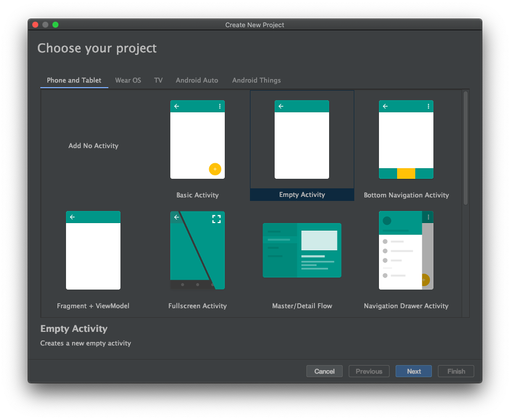
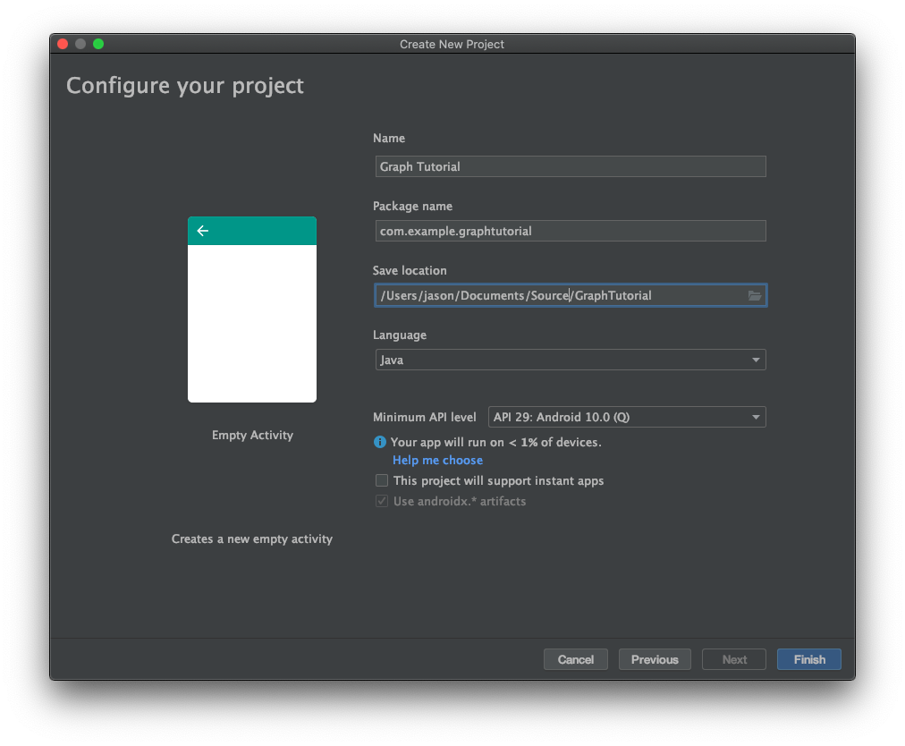
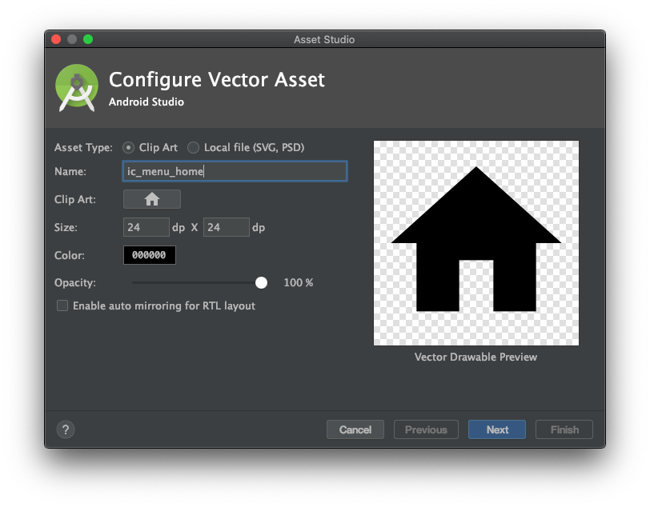
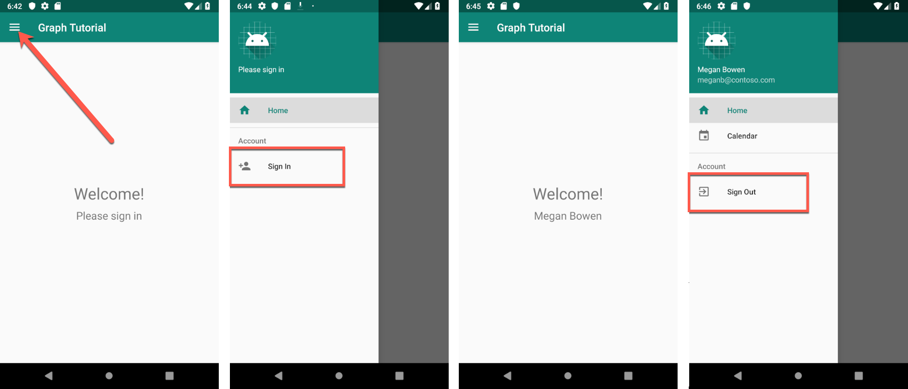

<!-- markdownlint-disable MD002 MD041 -->

Begin by creating a new Android Studio project.

1. Open Android Studio, and select **Start a new Android Studio project** on the welcome screen.

1. In the **Create New Project** dialog, select **Empty Activity**, then select **Next**.

    

1. In the **Configure your project** dialog, set the **Name** to `Graph Tutorial`, ensure the **Language** field is set to `Java`, and ensure the **Minimum API level** is set to `API 29: Android 10.0 (Q)`. Modify the **Package name** and **Save location** as needed. Select **Finish**.

    

> [!IMPORTANT]
> The code and instructions in this tutorial use the package name **com.example.graphtutorial**. If you use a different package name when creating the project, be sure to use your package name wherever you see this value.

## Install dependencies

Before moving on, install some additional dependencies that you will use later.

- `com.google.android.material:material` to make the [navigation view](https://material.io/develop/android/components/navigation-view/) available to the app.
- [Microsoft Authentication Library (MSAL) for Android](https://github.com/AzureAD/microsoft-authentication-library-for-android) to handle Azure AD authentication and token management.
- [Microsoft Graph SDK for Java](https://github.com/microsoftgraph/msgraph-sdk-java) for making calls to the Microsoft Graph.

1. Expand **Gradle Scripts**, then open **build.gradle (Module: Graph_Tutorial.app)**.

1. Add the following lines inside the `dependencies` value.

    :::code language="gradle" source="../demo/GraphTutorial/app/build.gradle" id="DependenciesSnippet":::

1. Add a `packagingOptions` value inside the `android` value in **build.gradle (Module: Graph_Tutorial.app)**.

    ```Gradle
    packagingOptions {
        pickFirst 'META-INF/*'
    }
    ```

1. Add the Azure Maven repository for the MicrosoftDeviceSDK library, a dependency of MSAL. Open **build.gradle (Project: Graph_Tutorial)**. Add the following to the `repositories` value inside the `allprojects` value.

    ```Gradle
    maven {
        url 'https://pkgs.dev.azure.com/MicrosoftDeviceSDK/DuoSDK-Public/_packaging/Duo-SDK-Feed/maven/v1'
    }
    ```

1. Save your changes. On the **File** menu, select **Sync Project with Gradle Files**.

## Design the app

The application will use a navigation drawer to navigate between different views. In this step you will update the activity to use a navigation drawer layout, and add fragments for the views.

### Create a navigation drawer

In this section you will create icons for the app's navigation menu, create a menu for the application, and update the application's theme and layout to be compatible with a navigation drawer.

#### Create icons

1. Right-click the **app/res/drawable** folder and select **New**, then **Vector Asset**.

1. Click the icon button next to **Clip Art**.

1. In the **Select Icon** window, type `home` in the search bar, then select the **Home** icon and select **OK**.

1. Change the **Name** to `ic_menu_home`.

    

1. Select **Next**, then **Finish**.

1. Repeat the previous step to create four more icons.

    - Name: `ic_menu_calendar`, Icon: `event`
    - Name: `ic_menu_add_event`, Icon: `add box`
    - Name: `ic_menu_signout`, Icon: `exit to app`
    - Name: `ic_menu_signin`, Icon: `person add`

#### Create the menu

1. Right-click the **res** folder and select **New**, then **Android Resource Directory**.

1. Change the **Resource type** to `menu` and select **OK**.

1. Right-click the new **menu** folder and select **New**, then **Menu resource file**.

1. Name the file `drawer_menu` and select **OK**.

1. When the file opens, select the **Code** tab to view the XML, then replace the entire contents with the following.

    :::code language="xml" source="../demo/GraphTutorial/app/src/main/res/menu/drawer_menu.xml":::

#### Update application theme and layout

1. Open the **app/res/values/themes.xml** file and add the following lines inside the `style` element.

    ```xml
    <item name="windowActionBar">false</item>
    <item name="windowNoTitle">true</item>
    ```

1. Open the **app/res/values-night/themes.xml** file and add the following lines inside the `style` element.

    ```xml
    <item name="windowActionBar">false</item>
    <item name="windowNoTitle">true</item>
    ```

1. Right-click the **app/res/layout** folder.

1. Select **New**, then **Layout resource file**.

1. Name the file `nav_header` and change the **Root element** to `LinearLayout`, then select **OK**.

1. Open the **nav_header.xml** file and select the **Code** tab. Replace the entire contents with the following.

    :::code language="xml" source="../demo/GraphTutorial/app/src/main/res/layout/nav_header.xml":::

1. Open the **app/res/layout/activity_main.xml** file and update the layout to a `DrawerLayout` by replacing the existing XML with the following.

    :::code language="xml" source="../demo/GraphTutorial/app/src/main/res/layout/activity_main.xml":::

1. Open **app/res/values/strings.xml** and add the following elements inside the `resources` element.

    ```xml
    <string name="navigation_drawer_open">Open navigation drawer</string>
    <string name="navigation_drawer_close">Close navigation drawer</string>
    ```

1. Open the **app/java/com.example/graphtutorial/MainActivity** file and replace the entire contents with the following.

    ```java
    package com.example.graphtutorial;

    import android.os.Bundle;
    import android.view.Menu;
    import android.view.MenuItem;
    import android.view.View;
    import android.widget.FrameLayout;
    import android.widget.ProgressBar;
    import android.widget.TextView;
    import androidx.annotation.NonNull;
    import androidx.appcompat.app.ActionBarDrawerToggle;
    import androidx.appcompat.app.AppCompatActivity;
    import androidx.appcompat.widget.Toolbar;
    import androidx.core.view.GravityCompat;
    import androidx.drawerlayout.widget.DrawerLayout;
    import com.google.android.material.navigation.NavigationView;

    public class MainActivity extends AppCompatActivity implements NavigationView.OnNavigationItemSelectedListener {
        private static final String SAVED_IS_SIGNED_IN = "isSignedIn";
        private static final String SAVED_USER_NAME = "userName";
        private static final String SAVED_USER_EMAIL = "userEmail";
        private static final String SAVED_USER_TIMEZONE = "userTimeZone";

        private DrawerLayout mDrawer;
        private NavigationView mNavigationView;
        private View mHeaderView;
        private boolean mIsSignedIn = false;
        private String mUserName = null;
        private String mUserEmail = null;
        private String mUserTimeZone = null;

        @Override
        protected void onCreate(Bundle savedInstanceState) {
            super.onCreate(savedInstanceState);
            setContentView(R.layout.activity_main);

            // Set the toolbar
            Toolbar toolbar = findViewById(R.id.toolbar);
            setSupportActionBar(toolbar);

            mDrawer = findViewById(R.id.drawer_layout);

            // Add the hamburger menu icon
            ActionBarDrawerToggle toggle = new ActionBarDrawerToggle(this, mDrawer, toolbar,
                    R.string.navigation_drawer_open, R.string.navigation_drawer_close);
            mDrawer.addDrawerListener(toggle);
            toggle.syncState();

            mNavigationView = findViewById(R.id.nav_view);

            // Set user name and email
            mHeaderView = mNavigationView.getHeaderView(0);
            setSignedInState(mIsSignedIn);

            // Listen for item select events on menu
            mNavigationView.setNavigationItemSelectedListener(this);

            if (savedInstanceState == null) {
                // Load the home fragment by default on startup
                openHomeFragment(mUserName);
            } else {
                // Restore state
                mIsSignedIn = savedInstanceState.getBoolean(SAVED_IS_SIGNED_IN);
                mUserName = savedInstanceState.getString(SAVED_USER_NAME);
                mUserEmail = savedInstanceState.getString(SAVED_USER_EMAIL);
                mUserTimeZone = savedInstanceState.getString(SAVED_USER_TIMEZONE);
                setSignedInState(mIsSignedIn);
            }
        }

        @Override
        protected void onSaveInstanceState(@NonNull Bundle outState) {
            super.onSaveInstanceState(outState);
            outState.putBoolean(SAVED_IS_SIGNED_IN, mIsSignedIn);
            outState.putString(SAVED_USER_NAME, mUserName);
            outState.putString(SAVED_USER_EMAIL, mUserEmail);
            outState.putString(SAVED_USER_TIMEZONE, mUserTimeZone);
        }

        @Override
        public boolean onNavigationItemSelected(@NonNull MenuItem menuItem) {
            // TEMPORARY
            return false;
        }

        @Override
        public void onBackPressed() {
            if (mDrawer.isDrawerOpen(GravityCompat.START)) {
                mDrawer.closeDrawer(GravityCompat.START);
            } else {
                super.onBackPressed();
            }
        }

        public void showProgressBar()
        {
            FrameLayout container = findViewById(R.id.fragment_container);
            ProgressBar progressBar = findViewById(R.id.progressbar);
            container.setVisibility(View.GONE);
            progressBar.setVisibility(View.VISIBLE);
        }

        public void hideProgressBar()
        {
            FrameLayout container = findViewById(R.id.fragment_container);
            ProgressBar progressBar = findViewById(R.id.progressbar);
            progressBar.setVisibility(View.GONE);
            container.setVisibility(View.VISIBLE);
        }

        // Update the menu and get the user's name and email
        private void setSignedInState(boolean isSignedIn) {
            mIsSignedIn = isSignedIn;

            mNavigationView.getMenu().clear();
            mNavigationView.inflateMenu(R.menu.drawer_menu);

            Menu menu = mNavigationView.getMenu();

            // Hide/show the Sign in, Calendar, and Sign Out buttons
            if (isSignedIn) {
                menu.removeItem(R.id.nav_signin);
            } else {
                menu.removeItem(R.id.nav_home);
                menu.removeItem(R.id.nav_calendar);
                menu.removeItem(R.id.nav_create_event);
                menu.removeItem(R.id.nav_signout);
            }

            // Set the user name and email in the nav drawer
            TextView userName = mHeaderView.findViewById(R.id.user_name);
            TextView userEmail = mHeaderView.findViewById(R.id.user_email);

            if (isSignedIn) {
                // For testing
                mUserName = "Lynne Robbins";
                mUserEmail = "lynner@contoso.com";
                mUserTimeZone = "Pacific Standard Time";

                userName.setText(mUserName);
                userEmail.setText(mUserEmail);
            } else {
                mUserName = null;
                mUserEmail = null;
                mUserTimeZone = null;

                userName.setText("Please sign in");
                userEmail.setText("");
            }
        }
    }
    ```

### Add fragments

In this section you will create fragments for the home and calendar views.

1. Right-click the **app/res/layout** folder and select **New**, then **Layout resource file**.

1. Name the file `fragment_home` and change the **Root element** to `RelativeLayout`, then select **OK**.

1. Open the **fragment_home.xml** file and replace its contents with the following.

    :::code language="xml" source="../demo/GraphTutorial/app/src/main/res/layout/fragment_home.xml":::

1. Right-click the **app/res/layout** folder and select **New**, then **Layout resource file**.

1. Name the file `fragment_calendar` and change the **Root element** to `RelativeLayout`, then select **OK**.

1. Open the **fragment_calendar.xml** file and replace its contents with the following.

    ```xml
    <?xml version="1.0" encoding="utf-8"?>
    <RelativeLayout xmlns:android="http://schemas.android.com/apk/res/android"
        android:layout_width="match_parent"
        android:layout_height="match_parent">

        <TextView
            android:layout_width="wrap_content"
            android:layout_height="wrap_content"
            android:layout_centerInParent="true"
            android:text="Calendar"
            android:textSize="30sp" />

    </RelativeLayout>
    ```

1. Right-click the **app/res/layout** folder and select **New**, then **Layout resource file**.

1. Name the file `fragment_new_event` and change the **Root element** to `RelativeLayout`, then select **OK**.

1. Open the **fragment_new_event.xml** file and replace its contents with the following.

    ```xml
    <?xml version="1.0" encoding="utf-8"?>
    <RelativeLayout xmlns:android="http://schemas.android.com/apk/res/android"
        android:layout_width="match_parent"
        android:layout_height="match_parent">

        <TextView
            android:layout_width="wrap_content"
            android:layout_height="wrap_content"
            android:layout_centerInParent="true"
            android:text="New Event"
            android:textSize="30sp" />

    </RelativeLayout>
    ```

1. Right-click the **app/java/com.example.graphtutorial** folder and select **New**, then **Java Class**.

1. Name the class `HomeFragment`, then select **OK**.

1. Open the **HomeFragment** file and replace its contents with the following.

    :::code language="java" source="../demo/GraphTutorial/app/src/main/java/com/example/graphtutorial/HomeFragment.java" id="HomeSnippet":::

1. Right-click the **app/java/com.example.graphtutorial** folder and select **New**, then **Java Class**.

1. Name the class `CalendarFragment`, then select **OK**.

1. Open the **CalendarFragment** file and replace its contents with the following.

    ```java
    package com.example.graphtutorial;

    import android.os.Bundle;
    import android.view.LayoutInflater;
    import android.view.View;
    import android.view.ViewGroup;
    import androidx.annotation.NonNull;
    import androidx.annotation.Nullable;
    import androidx.fragment.app.Fragment;

    public class CalendarFragment extends Fragment {
        private static final String TIME_ZONE = "timeZone";

        private String mTimeZone;

        public CalendarFragment() {}

        public static CalendarFragment createInstance(String timeZone) {
            CalendarFragment fragment = new CalendarFragment();

            // Add the provided time zone to the fragment's arguments
            Bundle args = new Bundle();
            args.putString(TIME_ZONE, timeZone);
            fragment.setArguments(args);
            return fragment;
        }

        @Override
        public void onCreate(@Nullable Bundle savedInstanceState) {
            super.onCreate(savedInstanceState);
            if (getArguments() != null) {
                mTimeZone = getArguments().getString(TIME_ZONE);
            }
        }

        @Nullable
        @Override
        public View onCreateView(@NonNull LayoutInflater inflater, @Nullable ViewGroup container, @Nullable Bundle savedInstanceState) {
            return inflater.inflate(R.layout.fragment_calendar, container, false);
        }
    }
    ```

1. Right-click the **app/java/com.example.graphtutorial** folder and select **New**, then **Java Class**.

1. Name the class `NewEventFragment`, then select **OK**.

1. Open the **NewEventFragment** file and replace its contents with the following.

    ```java
    package com.example.graphtutorial;

    import android.os.Bundle;
    import android.view.LayoutInflater;
    import android.view.View;
    import android.view.ViewGroup;
    import androidx.annotation.NonNull;
    import androidx.annotation.Nullable;
    import androidx.fragment.app.Fragment;

    public class NewEventFragment extends Fragment {
        private static final String TIME_ZONE = "timeZone";

        private String mTimeZone;

        public NewEventFragment() {}

        public static NewEventFragment createInstance(String timeZone) {
            NewEventFragment fragment = new NewEventFragment();

            // Add the provided time zone to the fragment's arguments
            Bundle args = new Bundle();
            args.putString(TIME_ZONE, timeZone);
            fragment.setArguments(args);
            return fragment;
        }

        @Override
        public void onCreate(@Nullable Bundle savedInstanceState) {
            super.onCreate(savedInstanceState);
            if (getArguments() != null) {
                mTimeZone = getArguments().getString(TIME_ZONE);
            }
        }

        @Nullable
        @Override
        public View onCreateView(@NonNull LayoutInflater inflater, @Nullable ViewGroup container, @Nullable Bundle savedInstanceState) {
            return inflater.inflate(R.layout.fragment_new_event, container, false);
        }
    }
    ```

1. Open the **MainActivity.java** file and add the the following functions to the class.

    ```java
    // Load the "Home" fragment
    public void openHomeFragment(String userName) {
        HomeFragment fragment = HomeFragment.createInstance(userName);
        getSupportFragmentManager().beginTransaction()
                .replace(R.id.fragment_container, fragment)
                .commit();
        mNavigationView.setCheckedItem(R.id.nav_home);
    }

    // Load the "Calendar" fragment
    private void openCalendarFragment(String timeZone) {
        CalendarFragment fragment = CalendarFragment.createInstance(timeZone);
        getSupportFragmentManager().beginTransaction()
                .replace(R.id.fragment_container, fragment)
                .commit();
        mNavigationView.setCheckedItem(R.id.nav_calendar);
    }

    // Load the "New Event" fragment
    private void openNewEventFragment(String timeZone) {
        NewEventFragment fragment = NewEventFragment.createInstance(timeZone);
        getSupportFragmentManager().beginTransaction()
                .replace(R.id.fragment_container, fragment)
                .commit();
        mNavigationView.setCheckedItem(R.id.nav_create_event);
    }

    private void signIn() {
        setSignedInState(true);
        openHomeFragment(mUserName);
    }

    private void signOut() {
        setSignedInState(false);
        openHomeFragment(mUserName);
    }
    ```

1. Replace the existing `onNavigationItemSelected` function with the following.

    :::code language="java" source="../demo/GraphTutorial/app/src/main/java/com/example/graphtutorial/MainActivity.java" id="OnNavItemSelectedSnippet":::

1. Save all of your changes.

1. On the **Run** menu, select **Run 'app'**.

The app's menu should work to navigate between the two fragments and change when you tap the **Sign in** or **Sign out** buttons.


