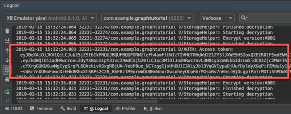

<!-- markdownlint-disable MD002 MD041 -->

In this exercise you will extend the application from the previous exercise to support authentication with Azure AD. This is required to obtain the necessary OAuth access token to call the Microsoft Graph. To do this, you will integrate the [Microsoft Authentication Library (MSAL) for Android](https://github.com/AzureAD/microsoft-authentication-library-for-android) into the application.

1. Right-click the **res** folder and select **New**, then **Android Resource Directory**.

1. Change the **Resource type** to `raw` and select **OK**.

1. Right-click the new **raw** folder and select **New**, then **File**.

1. Name the file `msal_config.json` and select **OK**.

1. Add the following to the **msal_config.json** file.

    :::code language="json" source="../demo/GraphTutorial/msal_config.json.example":::

1. Replace `YOUR_APP_ID_HERE` with the app ID from your app registration, and replace `com.example.graphtutorial` with your project's package name.

    > [!IMPORTANT]
    > If you're using source control such as git, now would be a good time to exclude the `msal_config.json` file from source control to avoid inadvertently leaking your app ID.

## Implement sign-in

In this section you will update the manifest to allow MSAL to use a browser to authenticate the user, register your redirect URI as being handled by the app, create an authentication helper class, and update the app to sign in and sign out.

1. Expand the **app/manifests** folder and open **AndroidManifest.xml**. Add the following elements above the `application` element.

    ```xml
    <uses-permission android:name="android.permission.INTERNET" />
    <uses-permission android:name="android.permission.ACCESS_NETWORK_STATE" />
    ```

    > [!NOTE]
    > These permissions are required in order for the MSAL library to authenticate the user.

1. Add the following element inside the `application` element, replacing the `YOUR_PACKAGE_NAME_HERE` string with your package name.

    ```xml
    <!--Intent filter to capture authorization code response from the default browser on the
        device calling back to the app after interactive sign in -->
    <activity
        android:name="com.microsoft.identity.client.BrowserTabActivity">
        <intent-filter>
            <action android:name="android.intent.action.VIEW" />
            <category android:name="android.intent.category.DEFAULT" />
            <category android:name="android.intent.category.BROWSABLE" />
            <data
                android:scheme="msauth"
                android:host="YOUR_PACKAGE_NAME_HERE"
                android:path="/callback" />
        </intent-filter>
    </activity>
    ```

1. Right-click the **app/java/com.example.graphtutorial** folder and select **New**, then **Java Class**. Change the **Kind** to **Interface**. Name the interface `IAuthenticationHelperCreatedListener` and select **OK**.

1. Open the new file and replace its contents with the following.

    :::code language="java" source="../demo/GraphTutorial/app/src/main/java/com/example/graphtutorial/IAuthenticationHelperCreatedListener.java" id="ListenerSnippet":::

1. Right-click the **app/java/com.example.graphtutorial** folder and select **New**, then **Java Class**. Name the class `AuthenticationHelper` and select **OK**.

1. Open the new file and replace its contents with the following.

    :::code language="java" source="../demo/GraphTutorial/app/src/main/java/com/example/graphtutorial/AuthenticationHelper.java" id="AuthHelperSnippet":::

1. Open **MainActivity** and add the following `import` statements.

    ```java
    import android.util.Log;

    import com.microsoft.identity.client.IAuthenticationResult;
    import com.microsoft.identity.client.exception.MsalClientException;
    import com.microsoft.identity.client.exception.MsalServiceException;
    import com.microsoft.identity.client.exception.MsalUiRequiredException;
    ```

1. Add the following member property to the `MainActivity` class.

    ```java
    private AuthenticationHelper mAuthHelper = null;
    ```

1. Add the following code to the end of the `onCreate` function.

    :::code language="java" source="../demo/GraphTutorial/app/src/main/java/com/example/graphtutorial/MainActivity.java" id="InitialLoginSnippet":::

1. Add the following functions to the `MainActivity` class.

    ```java
    // Silently sign in - used if there is already a
    // user account in the MSAL cache
    private void doSilentSignIn(boolean shouldAttemptInteractive) {
        mAuthHelper.acquireTokenSilently()
            .thenAccept(authenticationResult -> {
                handleSignInSuccess(authenticationResult);
            })
            .exceptionally(exception -> {
                // Check the type of exception and handle appropriately
                Throwable cause = exception.getCause();
                if (cause instanceof MsalUiRequiredException) {
                    Log.d("AUTH", "Interactive login required");
                    if (shouldAttemptInteractive) doInteractiveSignIn();
                } else if (cause instanceof MsalClientException) {
                    MsalClientException clientException = (MsalClientException)cause;
                    if (clientException.getErrorCode() == "no_current_account" ||
                        clientException.getErrorCode() == "no_account_found") {
                        Log.d("AUTH", "No current account, interactive login required");
                        if (shouldAttemptInteractive) doInteractiveSignIn();
                    }
                } else {
                    handleSignInFailure(cause);
                }
                hideProgressBar();
                return null;
            });
    }

    // Prompt the user to sign in
    private void doInteractiveSignIn() {
        mAuthHelper.acquireTokenInteractively(this)
            .thenAccept(authenticationResult -> {
                handleSignInSuccess(authenticationResult);
            })
            .exceptionally(exception -> {
                handleSignInFailure(exception);
                hideProgressBar();
                return null;
            });
    }

    // Handles the authentication result
    private void handleSignInSuccess(IAuthenticationResult authenticationResult) {
        // Log the token for debug purposes
        String accessToken = authenticationResult.getAccessToken();
        Log.d("AUTH", String.format("Access token: %s", accessToken));

        hideProgressBar();

        setSignedInState(true);
        openHomeFragment(mUserName);
    }

    private void handleSignInFailure(Throwable exception) {
        if (exception instanceof MsalServiceException) {
            // Exception when communicating with the auth server, likely config issue
            Log.e("AUTH", "Service error authenticating", exception);
        } else if (exception instanceof MsalClientException) {
            // Exception inside MSAL, more info inside MsalError.java
            Log.e("AUTH", "Client error authenticating", exception);
        } else {
            Log.e("AUTH", "Unhandled exception authenticating", exception);
        }
    }
    ```

1. Replace the existing `signIn` and `signOut` functions with the following.

    :::code language="java" source="../demo/GraphTutorial/app/src/main/java/com/example/graphtutorial/MainActivity.java" id="SignInAndOutSnippet":::

    > [!NOTE]
    > Notice that the `signIn` method does a silent sign-in (via `doSilentSignIn`). The callback for this method will do an interactive sign-in if the silent one fails. This avoids having to prompt the user every time they launch the app.

1. Save your changes and run the app.

1. When you tap the **Sign in** menu item, a browser opens to the Azure AD login page. Sign in with your account.

Once the app resumes, you should see an access token printed in the debug log in Android Studio.



## Get user details

In this section you will create a helper class to hold all of the calls to Microsoft Graph and update the `MainActivity` class to use this new class to get the logged-in user.

1. Right-click the **app/java/com.example.graphtutorial** folder and select **New**, then **Java Class**. Name the class `GraphHelper` and select **OK**.

1. Open the new file and replace its contents with the following.

    ```java
    package com.example.graphtutorial;

    import com.microsoft.graph.models.extensions.User;
    import com.microsoft.graph.requests.GraphServiceClient;

    import java.util.concurrent.CompletableFuture;

    // Singleton class - the app only needs a single instance
    // of the Graph client
    public class GraphHelper implements IAuthenticationProvider {
        private static GraphHelper INSTANCE = null;
        private GraphServiceClient mClient = null;

        private GraphHelper() {
            AuthenticationHelper authProvider = AuthenticationHelper.getInstance();

            mClient = GraphServiceClient.builder()
                .authenticationProvider(authProvider).buildClient();
        }

        public static synchronized GraphHelper getInstance() {
            if (INSTANCE == null) {
                INSTANCE = new GraphHelper();
            }

            return INSTANCE;
        }

        public CompletableFuture<User> getUser() {
            // GET /me (logged in user)
            return mClient.me().buildRequest()
                .select("displayName,mail,mailboxSettings,userPrincipalName")
                .getAsync();
    }
    }
    ```

    > [!NOTE]
    > Consider what this code does.
    >
    > - It exposes a `getUser` function to get the logged-in user's information from the `/me` Graph endpoint.
    >   - It uses `.select` to request only the properties of the user that the application needs.

1. Remove the following lines that set the user name and email:

    ```java
    // For testing
    mUserName = "Lynne Robbins";
    mUserEmail = "lynner@contoso.com";
    mUserTimeZone = "Pacific Standard Time";
    ```

1. Replace the existing `handleSignInSuccess` function with the following.

    :::code language="java" source="../demo/GraphTutorial/app/src/main/java/com/example/graphtutorial/MainActivity.java" id="HandleSignInSuccessSnippet":::

1. Save your changes and run the app. After sign-in the UI is updated with the user's display name and email address.
