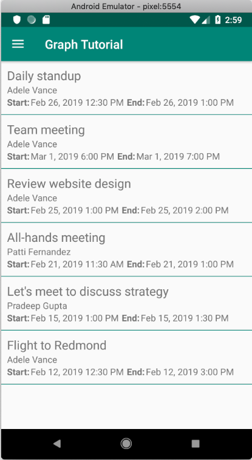

<!-- markdownlint-disable MD002 MD041 -->

In this exercise you will incorporate the Microsoft Graph into the application. For this application, you will use the [Microsoft Graph SDK for Java](https://github.com/microsoftgraph/msgraph-sdk-java) to make calls to Microsoft Graph.

## Get calendar events from Outlook

In this section you will extend the `GraphHelper` class to add a function to get the user's events and update `CalendarFragment` to use these new functions.

1. Open the **GraphHelper** file and add the following `import` statements to the top of the file.

    ```java
    import com.microsoft.graph.options.Option;
    import com.microsoft.graph.options.QueryOption;
    import com.microsoft.graph.requests.extensions.IEventCollectionPage;
    import java.util.LinkedList;
    import java.util.List;
    ```

1. Add the following functions to the `GraphHelper` class.

    ```java
    public void getEvents(String accessToken, ICallback<IEventCollectionPage> callback) {
        mAccessToken = accessToken;

        // Use query options to sort by created time
        final List<Option> options = new LinkedList<Option>();
        options.add(new QueryOption("orderby", "createdDateTime DESC"));


        // GET /me/events
        mClient.me().events().buildRequest(options)
                .select("subject,organizer,start,end")
                .get(callback);

    }

    // Debug function to get the JSON representation of a Graph
    // object
    public String serializeObject(Object object) {
        return mClient.getSerializer().serializeObject(object);
    }
    ```

    > [!NOTE]
    > Consider what the code in `getEvents` is doing.
    >
    > - The URL that will be called is `/v1.0/me/events`.
    > - The `select` function limits the fields returned for each events to just those the view will actually use.
    > - The `QueryOption` named `orderby` is used to sort the results by the date and time they were created, with the most recent item being first.

1. Add the following `import` statements to the top of the **CalendarFragment** file.

    ```java
    import android.util.Log;
    import android.widget.ListView;
    import android.widget.ProgressBar;
    import com.microsoft.graph.concurrency.ICallback;
    import com.microsoft.graph.core.ClientException;
    import com.microsoft.graph.models.extensions.Event;
    import com.microsoft.graph.requests.extensions.IEventCollectionPage;
    import com.microsoft.identity.client.AuthenticationCallback;
    import com.microsoft.identity.client.IAuthenticationResult;
    import com.microsoft.identity.client.exception.MsalException;
    import java.util.List;
    ```

1. Add the following members to the `CalendarFragment` class.

    ```java
    private List<Event> mEventList = null;
    private ProgressBar mProgress = null;
    ```

1. Add the following functions to the `CalendarFragment` class to hide and show the progress bar, and to provide a callback for the `getEvents` function in `GraphHelper`.

    ```java
    private void showProgressBar() {
        getActivity().runOnUiThread(new Runnable() {
            @Override
            public void run() {
                mProgress.setVisibility(View.VISIBLE);
            }
        });
    }

    private void hideProgressBar() {
        getActivity().runOnUiThread(new Runnable() {
            @Override
            public void run() {
                mProgress.setVisibility(View.GONE);
            }
        });
    }

    private ICallback<IEventCollectionPage> getEventsCallback() {
        return new ICallback<IEventCollectionPage>() {
            @Override
            public void success(IEventCollectionPage iEventCollectionPage) {
                mEventList = iEventCollectionPage.getCurrentPage();

                // Temporary for debugging
                String jsonEvents = GraphHelper.getInstance().serializeObject(mEventList);
                Log.d("GRAPH", jsonEvents);

                hideProgressBar();
            }

            @Override
            public void failure(ClientException ex) {
                Log.e("GRAPH", "Error getting events", ex);
                hideProgressBar();
            }
        };
    }
    ```

1. Override the `onCreate` function in the `CalendarFragment` class to get the user's events from Microsoft Graph.

    ```java
    @Override
    public void onCreate(@Nullable Bundle savedInstanceState) {
        super.onCreate(savedInstanceState);

        mProgress = getActivity().findViewById(R.id.progressbar);
        showProgressBar();

        // Get a current access token
        AuthenticationHelper.getInstance()
                .acquireTokenSilently(new AuthenticationCallback() {
                    @Override
                    public void onSuccess(IAuthenticationResult authenticationResult) {
                        final GraphHelper graphHelper = GraphHelper.getInstance();

                        // Get the user's events
                        graphHelper.getEvents(authenticationResult.getAccessToken(),
                                getEventsCallback());
                    }

                    @Override
                    public void onError(MsalException exception) {
                        Log.e("AUTH", "Could not get token silently", exception);
                        hideProgressBar();
                    }

                    @Override
                    public void onCancel() {
                        hideProgressBar();
                    }
                });
    }
    ```

Notice what this code does. First, it calls `acquireTokenSilently` to get the access token. Calling this method every time an access token is needed is a best practice because it takes advantage of MSAL's caching and token refresh abilities. Internally, MSAL checks for a cached token, then checks if it is expired. If the token is present and not expired, it just returns the cached token. If it is expired, it attempts to refresh the token before returning it.

Once the token is retrieved, the code then calls the `getEvents` method to get the user's events.

You can now run the app, sign in, and tap the **Calendar** navigation item in the menu. You should see a JSON dump of the events in the debug log in Android Studio.

## Display the results

Now you can replace the JSON dump with something to display the results in a user-friendly manner. In this section, you will add a `ListView` to the calendar fragment, create a layout for each item in the `ListView`, and create a custom list adapter for the `ListView` that maps the fields of each `Event` to the appropriate `TextView` in the view.

1. Replace the `TextView` in **app/res/layout/fragment_calendar.xml** with a `ListView`.

    ```xml
    <ListView
        android:id="@+id/eventlist"
        android:layout_width="match_parent"
        android:layout_height="match_parent"
        android:divider="@color/colorPrimary"
        android:dividerHeight="1dp" />
    ```

1. Right-click the **app/res/layout** folder and select **New**, then **Layout resource file**.

1. Name the file `event_list_item`, change the **Root element** to `RelativeLayout`, and select **OK**.

1. Open the **event_list_item.xml** file and replace its contents with the following.

    ```xml
    <?xml version="1.0" encoding="utf-8"?>
    <RelativeLayout xmlns:android="http://schemas.android.com/apk/res/android"
        android:layout_width="match_parent"
        android:layout_height="match_parent"
        android:padding="10dp">

        <TextView
            android:id="@+id/eventsubject"
            android:layout_width="match_parent"
            android:layout_height="wrap_content"
            android:text="Subject"
            android:textSize="20sp" />

        <TextView
            android:id="@+id/eventorganizer"
            android:layout_width="match_parent"
            android:layout_height="wrap_content"
            android:layout_below="@id/eventsubject"
            android:text="Adele Vance"
            android:textSize="15sp" />

        <LinearLayout
            android:layout_width="match_parent"
            android:layout_height="wrap_content"
            android:layout_below="@id/eventorganizer"
            android:orientation="horizontal">

            <TextView
                android:layout_width="wrap_content"
                android:layout_height="wrap_content"
                android:paddingEnd="2sp"
                android:text="Start:"
                android:textSize="15sp"
                android:textStyle="bold" />

            <TextView
                android:id="@+id/eventstart"
                android:layout_width="wrap_content"
                android:layout_height="wrap_content"
                android:text="1:30 PM 2/19/2019"
                android:textSize="15sp" />

            <TextView
                android:layout_width="wrap_content"
                android:layout_height="wrap_content"
                android:paddingStart="5sp"
                android:paddingEnd="2sp"
                android:text="End:"
                android:textSize="15sp"
                android:textStyle="bold" />

            <TextView
                android:id="@+id/eventend"
                android:layout_width="wrap_content"
                android:layout_height="wrap_content"
                android:text="1:30 PM 2/19/2019"
                android:textSize="15sp" />
        </LinearLayout>
    </RelativeLayout>
    ```

1. Right-click the **app/java/com.example.graphtutorial** folder and select **New**, then **Java Class**.

1. Name the class `EventListAdapter` and select **OK**.

1. Open the **EventListAdapter** file and replace its contents with the following.

    ```java
    package com.example.graphtutorial;

    import android.content.Context;
    import android.view.LayoutInflater;
    import android.view.View;
    import android.view.ViewGroup;
    import android.widget.ArrayAdapter;
    import android.widget.TextView;
    import androidx.annotation.NonNull;
    import com.microsoft.graph.models.extensions.DateTimeTimeZone;
    import com.microsoft.graph.models.extensions.Event;
    import java.time.LocalDateTime;
    import java.time.ZoneId;
    import java.time.ZonedDateTime;
    import java.time.format.DateTimeFormatter;
    import java.time.format.FormatStyle;
    import java.util.List;
    import java.util.TimeZone;

    public class EventListAdapter extends ArrayAdapter<Event> {
        private Context mContext;
        private int mResource;
        private ZoneId mLocalTimeZoneId;

        // Used for the ViewHolder pattern
        // https://developer.android.com/training/improving-layouts/smooth-scrolling
        static class ViewHolder {
            TextView subject;
            TextView organizer;
            TextView start;
            TextView end;
        }

        public EventListAdapter(Context context, int resource, List<Event> events) {
            super(context, resource, events);
            mContext = context;
            mResource = resource;
            mLocalTimeZoneId = TimeZone.getDefault().toZoneId();
        }

        @NonNull
        @Override
        public View getView(int position, View convertView, ViewGroup parent) {
            Event event = getItem(position);

            ViewHolder holder;

            if (convertView == null) {
                LayoutInflater inflater = LayoutInflater.from(mContext);
                convertView = inflater.inflate(mResource, parent, false);

                holder = new ViewHolder();
                holder.subject = convertView.findViewById(R.id.eventsubject);
                holder.organizer = convertView.findViewById(R.id.eventorganizer);
                holder.start = convertView.findViewById(R.id.eventstart);
                holder.end = convertView.findViewById(R.id.eventend);

                convertView.setTag(holder);
            } else {
                holder = (ViewHolder) convertView.getTag();
            }

            holder.subject.setText(event.subject);
            holder.organizer.setText(event.organizer.emailAddress.name);
            holder.start.setText(getLocalDateTimeString(event.start));
            holder.end.setText(getLocalDateTimeString(event.end));

            return convertView;
        }

        // Convert Graph's DateTimeTimeZone format to
        // a LocalDateTime, then return a formatted string
        private String getLocalDateTimeString(DateTimeTimeZone dateTime) {
            ZonedDateTime localDateTime = LocalDateTime.parse(dateTime.dateTime)
                    .atZone(ZoneId.of(dateTime.timeZone))
                    .withZoneSameInstant(mLocalTimeZoneId);

            return String.format("%s %s",
                    localDateTime.format(DateTimeFormatter.ofLocalizedDate(FormatStyle.MEDIUM)),
                    localDateTime.format(DateTimeFormatter.ofLocalizedTime(FormatStyle.SHORT)));
        }
    }
    ```

1. Open the **CalendarFragment** class and add the following function to the class.

    ```java
    private void addEventsToList() {
        getActivity().runOnUiThread(new Runnable() {
            @Override
            public void run() {
                ListView eventListView = getView().findViewById(R.id.eventlist);

                EventListAdapter listAdapter = new EventListAdapter(getActivity(),
                        R.layout.event_list_item, mEventList);

                eventListView.setAdapter(listAdapter);
            }
        });
    }
    ```

1. Add the following line of code in the `success` override after the `mEventList = iEventCollectionPage.getCurrentPage();` line.

    ```java
    addEventsToList();
    ```

1. Run the app, sign in, and tap the **Calendar** navigation item. You should see the list of events.

    
