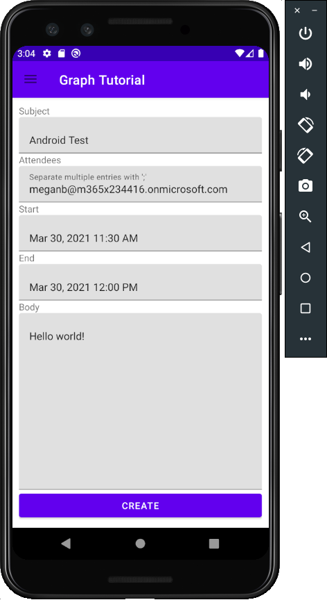

<!-- markdownlint-disable MD002 MD041 -->

In this section you will add the ability to create events on the user's calendar.

1. Open **GraphHelper** and add the following `import` statements to the top of the file.

    ```java
    import com.microsoft.graph.models.extensions.Attendee;
    import com.microsoft.graph.models.extensions.DateTimeTimeZone;
    import com.microsoft.graph.models.extensions.EmailAddress;
    import com.microsoft.graph.models.extensions.ItemBody;
    import com.microsoft.graph.models.generated.AttendeeType;
    import com.microsoft.graph.models.generated.BodyType;
    ```

1. Add the following function to the `GraphHelper` class to create a new event.

    :::code language="java" source="../demo/GraphTutorial/app/src/main/java/com/example/graphtutorial/GraphHelper.java" id="CreateEventSnippet":::

## Update new event fragment

1. Right-click the **app/java/com.example.graphtutorial** folder and select **New**, then **Java Class**. Name the class `EditTextDateTimePicker` and select **OK**.

1. Open the new file and replace its contents with the following.

    :::code language="java" source="../demo/GraphTutorial/app/src/main/java/com/example/graphtutorial/EditTextDateTimePicker.java" id="DateTimePickerSnippet":::

    This class wraps an `EditText` control, showing a date and time picker when the user taps it, and updating the value with the date and time picked.

1. Open **app/res/layout/fragment_new_event.xml** and replace its contents with the following.

    :::code language="xml" source="../demo/GraphTutorial/app/src/main/res/layout/fragment_new_event.xml":::

1. Open **NewEventFragment** and add the following `import` statements at the top of the file.

    ```java
    import android.util.Log;
    import android.widget.Button;
    import com.google.android.material.snackbar.BaseTransientBottomBar;
    import com.google.android.material.snackbar.Snackbar;
    import com.google.android.material.textfield.TextInputLayout;
    import com.microsoft.graph.concurrency.ICallback;
    import com.microsoft.graph.core.ClientException;
    import com.microsoft.graph.models.extensions.Event;
    import com.microsoft.identity.client.AuthenticationCallback;
    import com.microsoft.identity.client.IAuthenticationResult;
    import com.microsoft.identity.client.exception.MsalException;
    import java.time.ZoneId;
    import java.time.ZonedDateTime;
    ```

1. Add the following members to the `NewEventFragment` class.

    :::code language="java" source="../demo/GraphTutorial/app/src/main/java/com/example/graphtutorial/NewEventFragment.java" id="InputsSnippet":::

1. Add the following functions to show and hide a progress bar.

    :::code language="java" source="../demo/GraphTutorial/app/src/main/java/com/example/graphtutorial/NewEventFragment.java" id="ProgressBarSnippet":::

1. Add the following functions to get the values from the input controls and call the `GraphHelper.createEvent` function.

    :::code language="java" source="../demo/GraphTutorial/app/src/main/java/com/example/graphtutorial/NewEventFragment.java" id="CreateEventSnippet":::

1. Replace the existing `onCreateView` with the following.

    :::code language="java" source="../demo/GraphTutorial/app/src/main/java/com/example/graphtutorial/NewEventFragment.java" id="OnCreateViewSnippet":::

1. Save your changes and restart the app. Select the **New Event** menu item, fill in the form, and select **CREATE**.

    
