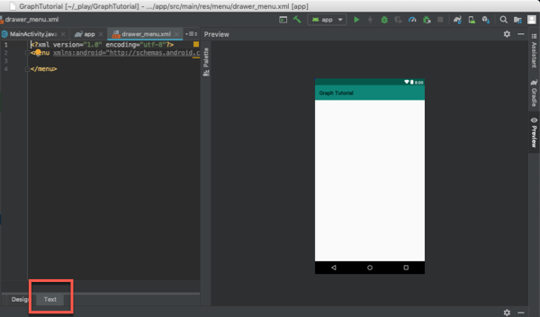
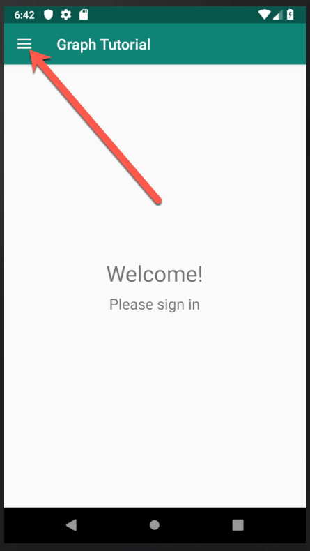
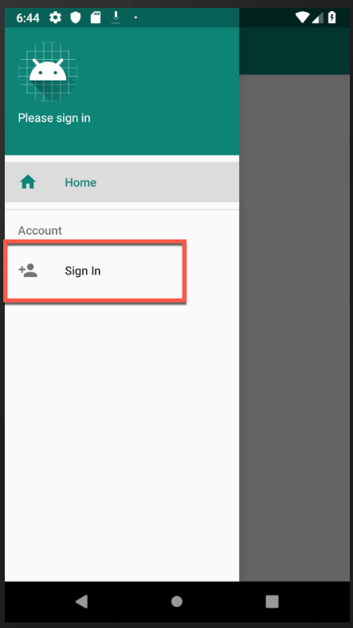
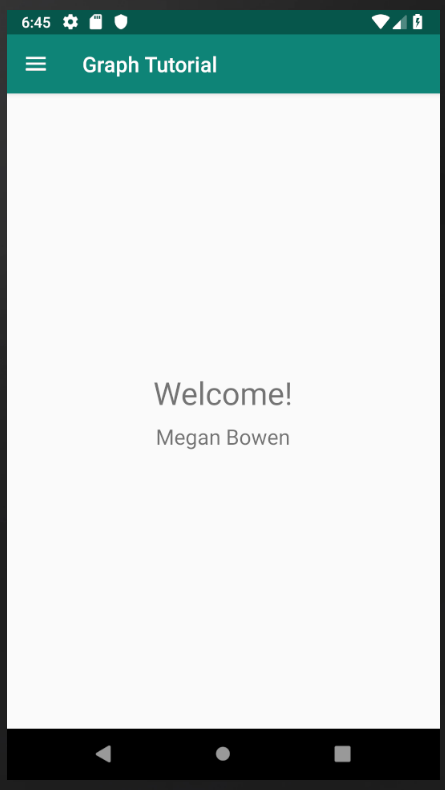
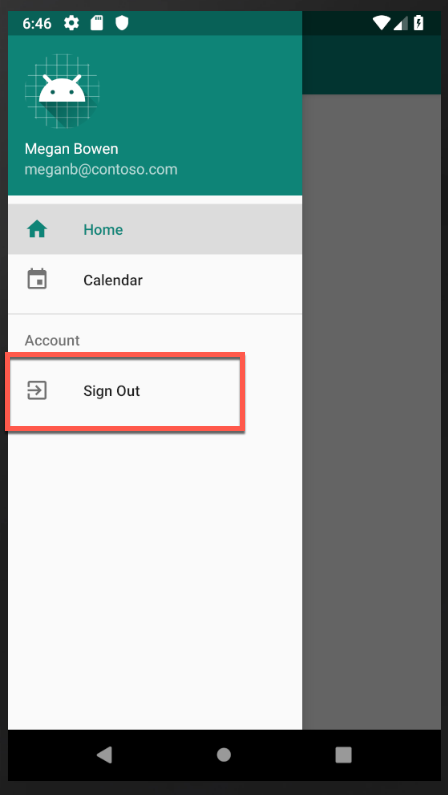

<!-- markdownlint-disable MD002 MD041 -->

1. Create an Android application:
    1. Open Android Studio, and select **Start a new Android Studio project** on the welcome screen.
    1. In the **Create New Project** dialog, select **Empty Activity**, then select **Next**.

        

    1. In the **Configure your project** dialog, set the **Name** to `Graph Tutorial`, ensure the **Language** field is set to `Java`, and ensure the **Minimum API level** is set to `API 27: Android 8.1 (Oreo)`.
    1. Modify the **Package name** and **Save location** as needed.
    1. Select **Finish**.

        

        > [!IMPORTANT]
        > Ensure that you enter the exact same name for the project that is specified in these lab instructions. The project name becomes part of the namespace in the code. The code inside these instructions depends on the namespace matching the project name specified in these instructions. If you use a different project name the code will not compile unless you adjust all the namespaces to match the project name you enter when you create the project.

1. Before moving on, install a design dependency that you will use. This is used to create a navigation drawer within the app:

    1. Expand **Gradle Scripts**, then open the **build.gradle (Module: app)** file.
    1. Add the following lines inside the `dependencies` value:

        ```Gradle
        implementation 'com.android.support:design:28.0.0'
        ```

        > [!NOTE]
        > If you are using a different SDK version, make sure to change the `28.0.0` to match the version of the `com.android.support:appcompat-v7` dependency already present in **build.gradle**.

    1. Add a `packagingOptions` inside the `android` value in the **build.gradle (Module: app)** file.

        ```Gradle
        packagingOptions {
          pickFirst 'META-INF/jersey-module-version'
        }
        ```

    1. Save your change and within Android Studio, select **File > Sync Project with Gradle Files**.

## Design the app

The application will use a [navigation drawer](https://developer.android.com/training/implementing-navigation/nav-drawer) to navigate between different views. In this step you will update the activity to use a navigation drawer layout, and add fragments for the views.

### Create a navigation drawer

1. Start by creating icons for the app's navigation menu.
    1. Right-click the **app/res/drawable** folder and select **New**, then **Vector Asset**.
    1. Click the icon button next to **Clip Art**.
    1. In the **Select Icon** window, type `home` in the search bar, then select the **Home** icon and select **OK**.
    1. Change the **Name** to `ic_menu_home`.

        

    1. Select **Next**, then **Finish**. Repeat this step to create more icons.
        - Name: `ic_menu_calendar`, Icon: `event`
        - Name: `ic_menu_signout`, Icon: `exit to app`
        - Name: `ic_menu_signin`, Icon: `person add`

1. Next, create a menu for the application.
    1. Right-click the **res** folder and select **New**, then **Android Resource Directory**.
    1. Change the **Resource type** to `menu` and select **OK**.
    1. Right-click the new **menu** folder and select **New**, then **Menu resource file**.
    1. Name the file `drawer_menu` and select **OK**.
    1. When the file opens, select the **Text** tab to view the XML...

        

        ...then replace the entire contents with the following:

        ```xml
        <?xml version="1.0" encoding="utf-8"?>
        <menu xmlns:android="http://schemas.android.com/apk/res/android"
            xmlns:tools="http://schemas.android.com/tools"
            tools:showIn="navigation_view">

            <group android:checkableBehavior="single">
                <item
                    android:id="@+id/nav_home"
                    android:icon="@drawable/ic_menu_home"
                    android:title="Home" />

                <item
                    android:id="@+id/nav_calendar"
                    android:icon="@drawable/ic_menu_calendar"
                    android:title="Calendar" />
            </group>

            <item android:title="Account">
                <menu>
                    <item
                        android:id="@+id/nav_signin"
                        android:icon="@drawable/ic_menu_signin"
                        android:title="Sign In" />

                    <item
                        android:id="@+id/nav_signout"
                        android:icon="@drawable/ic_menu_signout"
                        android:title="Sign Out" />
                </menu>
            </item>
        </menu>
        ```

1. Now update the application's theme to be compatible with a navigation drawer.
    1. Open the **app/res/values/styles.xml** file.
    1. Replace `Theme.AppCompat.Light.DarkActionBar` with `Theme.AppCompat.Light.NoActionBar`.
    1. Add the following lines inside the `style` element:

        ```xml
        <item name="windowActionBar">false</item>
        <item name="windowNoTitle">true</item>
        <item name="android:statusBarColor">@android:color/transparent</item>
        ```

1. Next, create a header for the menu.
    1. Right-click the **app/res/layout** folder.
    1. Select **New**, then **Layout resource file**.
    1. Name the file `nav_header` and change the **Root element** to `LinearLayout`.
    1. Select **OK**.
    1. Open the **nav_header.xml** file, select the **Text** tab and Replace the entire contents with the following:

        ```xml
        <?xml version="1.0" encoding="utf-8"?>
        <LinearLayout xmlns:android="http://schemas.android.com/apk/res/android"
            android:layout_width="match_parent"
            android:layout_height="176dp"
            android:background="@color/colorPrimary"
            android:gravity="bottom"
            android:orientation="vertical"
            android:padding="16dp"
            android:theme="@style/ThemeOverlay.AppCompat.Dark">

            <ImageView
                android:id="@+id/user_profile_pic"
                android:layout_width="wrap_content"
                android:layout_height="wrap_content"
                android:src="@mipmap/ic_launcher" />

            <TextView
                android:id="@+id/user_name"
                android:layout_width="wrap_content"
                android:layout_height="wrap_content"
                android:paddingTop="8dp"
                android:text="Test User"
                android:textAppearance="@style/TextAppearance.AppCompat.Body1" />

            <TextView
                android:id="@+id/user_email"
                android:layout_width="wrap_content"
                android:layout_height="wrap_content"
                android:text="test@contoso.com" />
        </LinearLayout>
        ```

1. Edit the app's Main activity to update user experience:
    1. Open the **app/res/layout/activity_main.xml** file.
    1. Update the layout to a `DrawerLayout` by replacing the existing XML with the following:

        ```xml
        <?xml version="1.0" encoding="utf-8"?>
        <android.support.v4.widget.DrawerLayout xmlns:android="http://schemas.android.com/apk/res/android"
            xmlns:app="http://schemas.android.com/apk/res-auto"
            xmlns:tools="http://schemas.android.com/tools"
            android:id="@+id/drawer_layout"
            android:layout_width="match_parent"
            android:layout_height="match_parent"
            android:fitsSystemWindows="true"
            tools:context=".MainActivity"
            tools:openDrawer="start">

            <RelativeLayout
                android:layout_width="match_parent"
                android:layout_height="match_parent"
                android:orientation="vertical">

                <ProgressBar
                    android:id="@+id/progressbar"
                    android:layout_width="75dp"
                    android:layout_height="75dp"
                    android:layout_centerInParent="true"
                    android:visibility="gone"/>

                <android.support.v7.widget.Toolbar
                    android:id="@+id/toolbar"
                    android:layout_width="match_parent"
                    android:layout_height="?attr/actionBarSize"
                    android:background="@color/colorPrimary"
                    android:elevation="4dp"
                    android:theme="@style/ThemeOverlay.AppCompat.Dark.ActionBar" />

                <FrameLayout
                    android:id="@+id/fragment_container"
                    android:layout_width="match_parent"
                    android:layout_height="match_parent"
                    android:layout_below="@+id/toolbar" />
            </RelativeLayout>

            <android.support.design.widget.NavigationView
                android:id="@+id/nav_view"
                android:layout_width="wrap_content"
                android:layout_height="match_parent"
                android:layout_gravity="start"
                app:headerLayout="@layout/nav_header"
                app:menu="@menu/drawer_menu" />

        </android.support.v4.widget.DrawerLayout>
        ```

    1. Next, open **app/res/values/strings.xml** and add the following elements inside the `resources` element.

        ```xml
        <string name="navigation_drawer_open">Open navigation drawer</string>
        <string name="navigation_drawer_close">Close navigation drawer</string>
        ```

    1. Finally, open the **app/java/com.microsoft.graphtutorial/MainActivity** file and replace the entire contents with the following:

        ```java
        package com.microsoft.graphtutorial;

        import android.support.annotation.NonNull;
        import android.support.design.widget.NavigationView;
        import android.support.v4.view.GravityCompat;
        import android.support.v4.widget.DrawerLayout;
        import android.support.v7.app.ActionBarDrawerToggle;
        import android.support.v7.app.AppCompatActivity;
        import android.os.Bundle;
        import android.support.v7.widget.Toolbar;
        import android.view.Menu;
        import android.view.MenuItem;
        import android.view.View;
        import android.widget.FrameLayout;
        import android.widget.ProgressBar;
        import android.widget.TextView;

        public class MainActivity extends AppCompatActivity implements NavigationView.OnNavigationItemSelectedListener {
            private DrawerLayout mDrawer;
            private NavigationView mNavigationView;
            private View mHeaderView;
            private boolean mIsSignedIn = false;
            private String mUserName = null;
            private String mUserEmail = null;

            @Override
            protected void onCreate(Bundle savedInstanceState) {
                super.onCreate(savedInstanceState);
                setContentView(R.layout.activity_main);

                // Set the toolbar
                Toolbar toolbar = findViewById(R.id.toolbar);
                setSupportActionBar(toolbar);

                mDrawer = findViewById(R.id.drawer_layout);

                // Add the hamburger menu icon
                ActionBarDrawerToggle toggle = new ActionBarDrawerToggle(this, mDrawer, toolbar,
                        R.string.navigation_drawer_open, R.string.navigation_drawer_close);
                mDrawer.addDrawerListener(toggle);
                toggle.syncState();

                mNavigationView = findViewById(R.id.nav_view);

                // Set user name and email
                mHeaderView = mNavigationView.getHeaderView(0);
                setSignedInState(mIsSignedIn);

                // Listen for item select events on menu
                mNavigationView.setNavigationItemSelectedListener(this);
            }

            @Override
            public boolean onNavigationItemSelected(@NonNull MenuItem menuItem) {
                // TEMPORARY
                return false;
            }

            @Override
            public void onBackPressed() {
                if (mDrawer.isDrawerOpen(GravityCompat.START)) {
                    mDrawer.closeDrawer(GravityCompat.START);
                } else {
                    super.onBackPressed();
                }
            }

            public void showProgressBar()
            {
                FrameLayout container = findViewById(R.id.fragment_container);
                ProgressBar progressBar = findViewById(R.id.progressbar);
                container.setVisibility(View.GONE);
                progressBar.setVisibility(View.VISIBLE);
            }

            public void hideProgressBar()
            {
                FrameLayout container = findViewById(R.id.fragment_container);
                ProgressBar progressBar = findViewById(R.id.progressbar);
                progressBar.setVisibility(View.GONE);
                container.setVisibility(View.VISIBLE);
            }

            // Update the menu and get the user's name and email
            private void setSignedInState(boolean isSignedIn) {
                mIsSignedIn = isSignedIn;

                Menu menu = mNavigationView.getMenu();

                // Hide/show the Sign in, Calendar, and Sign Out buttons
                menu.findItem(R.id.nav_signin).setVisible(!isSignedIn);
                menu.findItem(R.id.nav_calendar).setVisible(isSignedIn);
                menu.findItem(R.id.nav_signout).setVisible(isSignedIn);

                // Set the user name and email in the nav drawer
                TextView userName = mHeaderView.findViewById(R.id.user_name);
                TextView userEmail = mHeaderView.findViewById(R.id.user_email);

                if (isSignedIn) {
                    // For testing
                    mUserName = "Megan Bowen";
                    mUserEmail = "meganb@contoso.com";

                    userName.setText(mUserName);
                    userEmail.setText(mUserEmail);
                } else {
                    mUserName = null;
                    mUserEmail = null;

                    userName.setText("Please sign in");
                    userEmail.setText("");
                }
            }
        }
        ```

    1. Save all files.

### Add fragments

Create UX fragments to be used in different situations, such as if the user is or is not signed in:

1. Create the home fragment resource:
    1. Right-click the **app/res/layout** folder and select **New**, then **Layout resource file**
    1. Name the file `fragment_home` and change the **Root element** to `RelativeLayout`.
    1. Select **OK**.
    1. Open the **fragment_home.xml** file and replace its contents with the following.

        ```xml
        <?xml version="1.0" encoding="utf-8"?>
        <RelativeLayout xmlns:android="http://schemas.android.com/apk/res/android"
            android:layout_width="match_parent"
            android:layout_height="match_parent">

            <LinearLayout
                android:layout_width="wrap_content"
                android:layout_height="wrap_content"
                android:layout_centerInParent="true"
                android:orientation="vertical">

                <TextView
                    android:layout_width="wrap_content"
                    android:layout_height="wrap_content"
                    android:layout_gravity="center_horizontal"
                    android:text="Welcome!"
                    android:textSize="30sp" />

                <TextView
                    android:id="@+id/home_page_username"
                    android:layout_width="wrap_content"
                    android:layout_height="wrap_content"
                    android:layout_gravity="center_horizontal"
                    android:paddingTop="8dp"
                    android:text="Please sign in"
                    android:textSize="20sp" />
            </LinearLayout>

        </RelativeLayout>
        ```

1. Create the calendar fragment resource:
    1. Right-click the **app/res/layout** folder and select **New**, then **Layout resource file**.
    1. Name the file `fragment_calendar` and change the **Root element** to `RelativeLayout`.
    1. Select **OK**.
    1. Open the **fragment_calendar.xml** file and replace its contents with the following:

        ```xml
        <?xml version="1.0" encoding="utf-8"?>
        <RelativeLayout xmlns:android="http://schemas.android.com/apk/res/android"
            android:layout_width="match_parent"
            android:layout_height="match_parent">

            <TextView
                android:layout_width="wrap_content"
                android:layout_height="wrap_content"
                android:layout_centerInParent="true"
                android:text="Calendar"
                android:textSize="30sp" />

        </RelativeLayout>
        ```

1. Create the home fragment class:
    1. Now, right-click the **app/java/com.microsoft.graphtutorial** folder and select **New**, then **Java Class**.
    1. Name the class `HomeFragment` and set the **Superclass** to `android.support.v4.app.Fragment`.
    1. Select **OK**.
    1. Open the **HomeFragment** file and replace its contents with the following:

        ```java
        package com.microsoft.graphtutorial;

        import android.os.Bundle;
        import android.support.annotation.NonNull;
        import android.support.annotation.Nullable;
        import android.support.v4.app.Fragment;
        import android.view.LayoutInflater;
        import android.view.View;
        import android.view.ViewGroup;
        import android.widget.TextView;

        public class HomeFragment extends Fragment {
            private static final String USER_NAME = "userName";

            private String mUserName;

            public HomeFragment() {

            }

            public static HomeFragment createInstance(String userName) {
                HomeFragment fragment = new HomeFragment();

                // Add the provided username to the fragment's arguments
                Bundle args = new Bundle();
                args.putString(USER_NAME, userName);
                fragment.setArguments(args);
                return fragment;
            }

            @Override
            public void onCreate(@Nullable Bundle savedInstanceState) {
                super.onCreate(savedInstanceState);
                if (getArguments() != null) {
                    mUserName = getArguments().getString(USER_NAME);
                }
            }

            @Nullable
            @Override
            public View onCreateView(@NonNull LayoutInflater inflater, @Nullable ViewGroup container, @Nullable Bundle savedInstanceState) {
                View homeView = inflater.inflate(R.layout.fragment_home, container, false);

                // If there is a username, replace the "Please sign in" with the username
                if (mUserName != null) {
                    TextView userName = homeView.findViewById(R.id.home_page_username);
                    userName.setText(mUserName);
                }

                return homeView;
            }
        }
        ```

1. Create the Calendar fragment class:
    1. Next, right-click the **app/java/com.microsoft.graphtutorial** folder and select **New**, then **Java Class**.
    1. Name the class `CalendarFragment` and set the **Superclass** to `android.support.v4.app.Fragment`.
    1. Select **OK**.
    1. Open the **CalendarFragment** file and replace its contents with the following:

        ```java
        package com.microsoft.graphtutorial;

        import android.os.Bundle;
        import android.support.annotation.NonNull;
        import android.support.annotation.Nullable;
        import android.support.v4.app.Fragment;
        import android.view.LayoutInflater;
        import android.view.View;
        import android.view.ViewGroup;

        public class CalendarFragment extends Fragment {
          @Nullable
          @Override
          public View onCreateView(@NonNull LayoutInflater inflater, @Nullable ViewGroup container, @Nullable Bundle savedInstanceState) {
            return inflater.inflate(R.layout.fragment_calendar, container, false);
          }
        }
        ```

Now that the fragments are implemented, update the `MainActivity` class to handle the `onNavigationItemSelected` event and use the fragments.

1. Locate and open the file **app/java/com.microsoft.graphtutorial/MainActivity**.
1. Add the following functions to the `MainActivity` class:

    ```java
    // Load the "Home" fragment
    public void openHomeFragment(String userName) {
        HomeFragment fragment = HomeFragment.createInstance(userName);
        getSupportFragmentManager().beginTransaction()
                .replace(R.id.fragment_container, fragment)
                .commit();
        mNavigationView.setCheckedItem(R.id.nav_home);
    }

    // Load the "Calendar" fragment
    private void openCalendarFragment() {
        getSupportFragmentManager().beginTransaction()
                .replace(R.id.fragment_container, new CalendarFragment())
                .commit();
        mNavigationView.setCheckedItem(R.id.nav_calendar);
    }

    private void signIn() {
        setSignedInState(true);
        openHomeFragment(mUserName);
    }

    private void signOut() {
        setSignedInState(false);
        openHomeFragment(mUserName);
    }
    ```

1. Next, replace the existing `onNavigationItemSelected` function with the following:

    ```java
    @Override
    public boolean onNavigationItemSelected(@NonNull MenuItem menuItem) {
        // Load the fragment that corresponds to the selected item
        switch (menuItem.getItemId()) {
            case R.id.nav_home:
                openHomeFragment(mUserName);
                break;
            case R.id.nav_calendar:
                openCalendarFragment();
                break;
            case R.id.nav_signin:
                signIn();
                break;
            case R.id.nav_signout:
                signOut();
                break;
        }

        mDrawer.closeDrawer(GravityCompat.START);

        return true;
    }
    ```

1. Finally, add the following at the end of the `onCreate` function to load the home fragment when the app starts:

    ```java
    // Load the home fragment by default on startup
    if (savedInstanceState == null) {
        openHomeFragment(mUserName);
    }
    ```

1. Save all of your changes.

### Test the application

Test the application to ensure everything works up to this point:

1. Within Android Studio, select **Run > Run 'app'**.
1. The app's menu should work to navigate between the two fragments and change when you tap the **Sign in** or **Sign out** buttons.

    

    

    

    