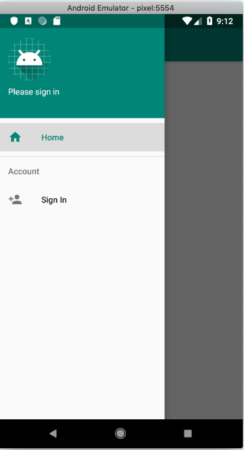

<!-- markdownlint-disable MD002 MD041 -->

Open Android Studio, and select **Start a new Android Studio project** on the welcome screen. In the **Create New Project** dialog, select **Empty Activity**, then choose **Next**.


In the **Configure your project** dialog, set the **Name** to `Graph Tutorial`, ensure the **Language** field is set to `Java`, and ensure the **Minimum API level** is set to `API 27: Android 8.1 (Oreo)`. Modify the **Package name** and **Save location** as needed. Select **Finish**.


> [!IMPORTANT]
> Ensure that you enter the exact same name for the Visual Studio Project that is specified in these lab instructions. The Visual Studio Project name becomes part of the namespace in the code. The code inside these instructions depends on the namespace matching the Visual Studio Project name specified in these instructions. If you use a different project name the code will not compile unless you adjust all the namespaces to match the Visual Studio Project name you enter when you create the project.

Before moving on, install some additional libraries that you will use later.

- [Microsoft Authentication Library (MSAL) for Android](https://github.com/AzureAD/microsoft-authentication-library-for-android) to handle Azure AD authentication and token management.
- [Microsoft Graph SDK for Java](https://github.com/microsoftgraph/msgraph-sdk-java) for making calls to the Microsoft Graph.

Expand **Gradle Scripts**, then open the **build.gradle (Module: app)** file. Add the following to the file.

```Gradle
repositories {
    jcenter()
}
```

Then add the following lines inside the `dependencies` value.

```Gradle
implementation 'com.microsoft.graph:microsoft-graph:1.1.+'
implementation 'com.microsoft.identity.client:msal:0.2.+'
```

Save your changes. On the **File** menu, select **Sync Project with Gradle Files**.

## Design the app

Start by updating the `App` class to add variables to track the authentication state and the signed-in user. In **Solution Explorer**, expand the **GraphTutorial** project, then expand the **App.xaml** file. Open the **App.xaml.cs** file and add the following `using` statements to the top of the file.

```cs
using System.ComponentModel;
using System.IO;
using System.Reflection;
using System.Threading.Tasks;
```

Next, add the `INotifyPropertyChanged` interface to the class declaration.

```cs
public partial class App : Application, INotifyPropertyChanged
```

Now add the following properties to the `App` class.

```cs
// Is a user signed in?
private bool isSignedIn;
public bool IsSignedIn
{
    get { return isSignedIn; }
    set
    {
        isSignedIn = value;
        OnPropertyChanged("IsSignedIn");
        OnPropertyChanged("IsSignedOut");
    }
}

public bool IsSignedOut { get { return !isSignedIn; } }

// The user's display name
private string userName;
public string UserName
{
    get { return userName; }
    set
    {
        userName = value;
        OnPropertyChanged("UserName");
    }
}

// The user's email address
private string userEmail;
public string UserEmail
{
    get { return userEmail; }
    set
    {
        userEmail = value;
        OnPropertyChanged("UserEmail");
    }
}

// The user's profile photo
private ImageSource userPhoto;
public ImageSource UserPhoto
{
    get { return userPhoto; }
    set
    {
        userPhoto = value;
        OnPropertyChanged("UserPhoto");
    }
}
```

Now add the following functions to the `App` class. The `SignIn`, `SignOut`, and `GetUserInfo` functions are just placeholders for now.

```cs
public async Task SignIn()
{
    await GetUserInfo();

    IsSignedIn = true;
}

public async Task SignOut()
{
    UserPhoto = null;
    UserName = string.Empty;
    UserEmail = string.Empty;
    IsSignedIn = false;
}

private async Task GetUserInfo()
{
    UserPhoto = ImageSource.FromStream(() => GetUserPhoto());
    UserName = "Adele Vance";
    UserEmail = "adelev@contoso.com";
}

private Stream GetUserPhoto()
{
    // Return the default photo
    return Assembly.GetExecutingAssembly().GetManifestResourceStream("GraphTutorial.no-profile-pic.png");
}
```

The `GetUserPhoto` function returns a default photo for now. You can either supply your own file here, or you can download the one used in the sample from [GitHub](https://github.com/microsoftgraph/msgraph-training-xamarin/blob/master/tutorial/images/no-profile-pic.png). Copy the file to the `./GraphTutorial/GraphTutorial` directory. Right-click the **GraphTutorial** project in **Solution Explorer** and choose **Add**, then **Existing Item...**. Select the `no-profile-pic.png` file and choose **Add**. Now right-click the file in **Solution Explorer** and choose **Properties**. In the **Properties** window, change the value of **Build Action** to **Embedded resource**.


### App navigation

Next, change the application's main page to a [Master-Detail page](/xamarin/xamarin-forms/app-fundamentals/navigation/master-detail-page). This will provide a navigation menu to switch between view in the app.

Open the **MainPage.xaml** file in the **GraphTutorial** project and replace its contents with the following.

```xml
<?xml version="1.0" encoding="utf-8" ?>
<MasterDetailPage xmlns="http://xamarin.com/schemas/2014/forms"
             xmlns:x="http://schemas.microsoft.com/winfx/2009/xaml"
             xmlns:local="clr-namespace:GraphTutorial"
             x:Class="GraphTutorial.MainPage">

    <MasterDetailPage.Master>
        <local:MenuPage/>
    </MasterDetailPage.Master>

    <MasterDetailPage.Detail>
        <NavigationPage>
            <x:Arguments>
                <local:WelcomePage/>
            </x:Arguments>
        </NavigationPage>
    </MasterDetailPage.Detail>

</MasterDetailPage>
```

#### Implement the menu

Start by creating a model to represent the menu items. Right-click the **GraphTutorial** project and choose **Add**, then **New Folder**. Name the folder `Models`.

Right-click the **Models** folder and choose **Add**, then **Class...**. Name the class `NavMenuItem` and choose **Add**. Open the **NavMenuItem.cs** file and replace its contents with the following.

```cs
namespace GraphTutorial.Models
{
    public enum MenuItemType
    {
        Welcome,
        Calendar
    }

    public class NavMenuItem
    {
        public MenuItemType Id { get; set; }

        public string Title { get; set; }
    }
}
```

Now add the menu page. Right-click the **GraphTutorial** project and select **Add**, then **New Item...**. Choose **Content Page** and name the page `MenuPage`. Choose **Add**. Open the **MenuPage.xaml** file and replace its contents with the following.

```xml
<?xml version="1.0" encoding="utf-8" ?>
<ContentPage xmlns="http://xamarin.com/schemas/2014/forms"
             xmlns:x="http://schemas.microsoft.com/winfx/2009/xaml"
             xmlns:ios="clr-namespace:Xamarin.Forms.PlatformConfiguration.iOSSpecific;assembly=Xamarin.Forms.Core"
             ios:Page.UseSafeArea="true"
             Title="Menu"
             x:Class="GraphTutorial.MenuPage">
    <ContentPage.Padding>
        <OnPlatform x:TypeArguments="Thickness">
            <On Platform="UWP" Value="10, 10, 10, 10" />
        </OnPlatform>
    </ContentPage.Padding>
    <ContentPage.Content>
        <StackLayout VerticalOptions="Start" HorizontalOptions="Center">
            <StackLayout x:Name="UserArea" />

            <!-- Signed out UI -->
            <StackLayout IsVisible="{Binding Path=IsSignedOut, Source={x:Static Application.Current}}">
                <Label Text="Sign in to get started"
                       HorizontalOptions="Center"
                       FontAttributes="Bold"
                       FontSize="Medium"
                       Margin="10,20,10,20" />
                <Button Text="Sign in"
                        Clicked="OnSignIn"
                        HorizontalOptions="Center" />
            </StackLayout>

            <!-- Signed in UI -->
            <StackLayout IsVisible="{Binding Path=IsSignedIn, Source={x:Static Application.Current}}">
                <Image Source="{Binding Path=UserPhoto, Source={x:Static Application.Current}}"
                       HorizontalOptions="Center"
                       Margin="0,20,0,10" />
                <Label Text="{Binding Path=UserName, Source={x:Static Application.Current}}"
                       HorizontalOptions="Center"
                       FontAttributes="Bold"
                       FontSize="Small" />
                <Label Text="{Binding Path=UserEmail, Source={x:Static Application.Current}}"
                       HorizontalOptions="Center"
                       FontAttributes="Italic" />
                <Button Text="Sign out"
                        Margin="0,20,0,20"
                        Clicked="OnSignOut"
                        HorizontalOptions="Center" />
                <ListView x:Name="ListViewMenu"
                          HasUnevenRows="True"
                          HorizontalOptions="Start">
                    <ListView.ItemTemplate>
                        <DataTemplate>
                            <ViewCell>
                                <Grid Padding="10">
                                    <Label Text="{Binding Title}" FontSize="20"/>
                                </Grid>
                            </ViewCell>
                        </DataTemplate>
                    </ListView.ItemTemplate>
                </ListView>
            </StackLayout>
        </StackLayout>
    </ContentPage.Content>
</ContentPage>
```

Now, expand **MenuPage.xaml** in **Solution Explorer** and open the **MenuPage.xaml.cs** file. Replace its contents with the following.

```cs
using System;
using System.Collections.Generic;
using System.Linq;
using System.Text;
using System.Threading.Tasks;

using Xamarin.Forms;
using Xamarin.Forms.Xaml;

using GraphTutorial.Models;

namespace GraphTutorial
{
    [XamlCompilation(XamlCompilationOptions.Compile)]
    public partial class MenuPage : ContentPage
    {
        MainPage RootPage { get => Application.Current.MainPage as MainPage; }
        List<NavMenuItem> menuItems;

        public MenuPage ()
        {
            InitializeComponent ();

            // Add items to the menu
            menuItems = new List<NavMenuItem>
            {
                new NavMenuItem {Id = MenuItemType.Welcome, Title="Home" },
                new NavMenuItem {Id = MenuItemType.Calendar, Title="Calendar" }
            };
            ListViewMenu.ItemsSource = menuItems;

            // Initialize the selected item
            ListViewMenu.SelectedItem = menuItems[0];

            // Handle the ItemSelected event to navigate to the
            // selected page
            ListViewMenu.ItemSelected += async (sender, e) =>
            {
                if (e.SelectedItem == null)
                    return;

                var id = (int)((NavMenuItem)e.SelectedItem).Id;
                await RootPage.NavigateFromMenu(id);
            };
        }

        private async void OnSignOut(object sender, EventArgs e)
        {
            var signout = await DisplayAlert("Sign out?", "Do you want to sign out?", "Yes", "No");
            if (signout)
            {
                await (Application.Current as App).SignOut();
            }
        }

        private async void OnSignIn(object sender, EventArgs e)
        {
            await (Application.Current as App).SignIn();
        }
    }
}
```

#### Implement the welcome page

Right-click the **GraphTutorial** project and select **Add**, then **New Item...**. Choose **Content Page** and name the page `WelcomePage`. Choose **Add**. Open the **WelcomePage.xaml** file and replace its contents with the following.

```xml
<?xml version="1.0" encoding="utf-8" ?>
<ContentPage xmlns="http://xamarin.com/schemas/2014/forms"
             xmlns:x="http://schemas.microsoft.com/winfx/2009/xaml"
             Title="Home"
             x:Class="GraphTutorial.WelcomePage">
    <ContentPage.Padding>
        <OnPlatform x:TypeArguments="Thickness">
            <On Platform="UWP" Value="10, 10, 10, 10" />
        </OnPlatform>
    </ContentPage.Padding>
    <ContentPage.Content>
        <StackLayout>
            <Label Text="Graph Xamarin Tutorial App"
                       HorizontalOptions="Center"
                       FontAttributes="Bold"
                       FontSize="Large"
                       Margin="10,20,10,20" />

            <!-- Signed out UI -->
            <StackLayout IsVisible="{Binding Path=IsSignedOut, Source={x:Static Application.Current}}">
                <Label Text="Please sign in to get started"
                       HorizontalOptions="Center"
                       FontSize="Medium"
                       Margin="10,0,10,20"/>
                <Button Text="Sign in"
                        HorizontalOptions="Center"
                        Clicked="OnSignIn" />
            </StackLayout>

            <!-- Signed in UI -->
            <StackLayout IsVisible="{Binding Path=IsSignedIn, Source={x:Static Application.Current}}">
                <Label Text="{Binding Path=UserName, Source={x:Static Application.Current}, StringFormat='Welcome \{0\}!'}"
                       HorizontalOptions="Center"
                       FontSize="Medium"/>
            </StackLayout>
        </StackLayout>
    </ContentPage.Content>
</ContentPage>
```

Now, expand **WelcomePage.xaml** in **Solution Explorer** and open the **WelcomePage.xaml.cs** file. Add the following function to the `WelcomePage` class.

```cs
private void OnSignIn(object sender, EventArgs e)
{
    (App.Current.MainPage as MasterDetailPage).IsPresented = true;
}
```

#### Add calendar page

Now add a calendar page. This will just be a placeholder for now. Right-click the **GraphTutorial** project and select **Add**, then **New Item...**. Choose **Content Page** and name the page `CalendarPage`. Choose **Add**.

Leave the added page as-is for now.

#### Update MainPage code-behind

Now that all of the pages are in place, update the code-behind for **MainPage.xaml**. Expand **MainPage.xaml** in **Solution Explorer** and open the **MainPage.xaml.cs** file and replace its entire contents with the following.

```cs
using System;
using System.Collections.Generic;
using System.IO;
using System.Linq;
using System.Reflection;
using System.Text;
using System.Threading.Tasks;
using Xamarin.Forms;
using GraphTutorial.Models;

namespace GraphTutorial
{
    public partial class MainPage : MasterDetailPage
    {
        Dictionary<int, NavigationPage> MenuPages = new Dictionary<int, NavigationPage>();

        public MainPage()
        {
            InitializeComponent();

            MasterBehavior = MasterBehavior.Popover;

            // Load the welcome page at start
            MenuPages.Add((int)MenuItemType.Welcome, (NavigationPage)Detail);
        }

        // Navigate to the selected page
        public async Task NavigateFromMenu(int id)
        {
            if (!MenuPages.ContainsKey(id))
            {
                switch (id)
                {
                    case (int)MenuItemType.Welcome:
                        MenuPages.Add(id, new NavigationPage(new WelcomePage()));
                        break;
                    case (int)MenuItemType.Calendar:
                        MenuPages.Add(id, new NavigationPage(new CalendarPage()));
                        break;
                }
            }

            var newPage = MenuPages[id];

            if (newPage != null && Detail != newPage)
            {
                Detail = newPage;

                if (Device.RuntimePlatform == Device.Android)
                    await Task.Delay(100);

                IsPresented = false;
            }
        }
    }
}
```

Save all of your changes. Right-click the project that you want to run (Android, iOS, or UWP) and choose **Set as StartUp Project**. Press **F5** or select **Debug > Start Debugging** in Visual Studio.

